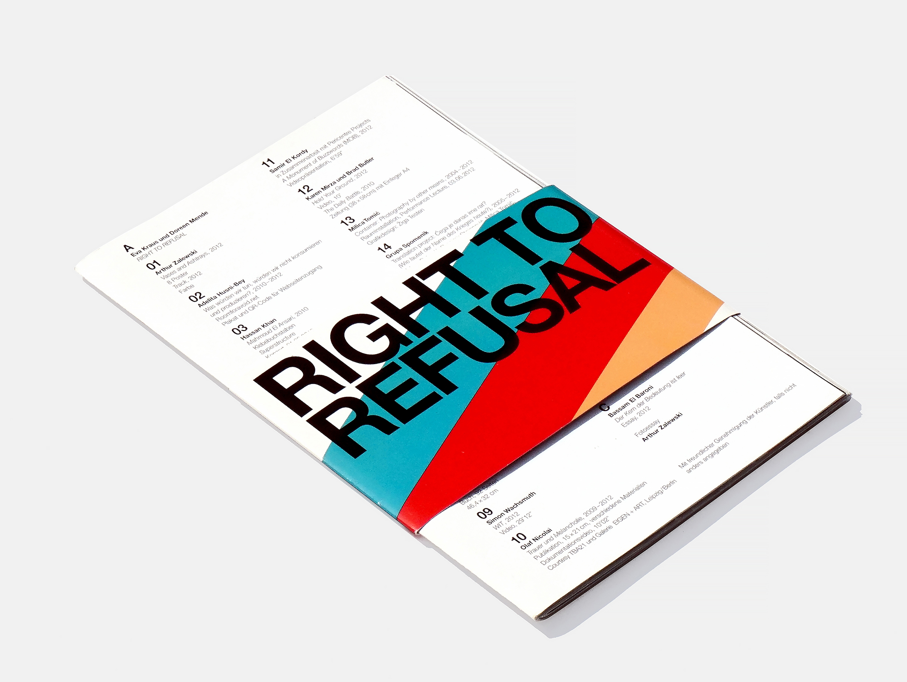
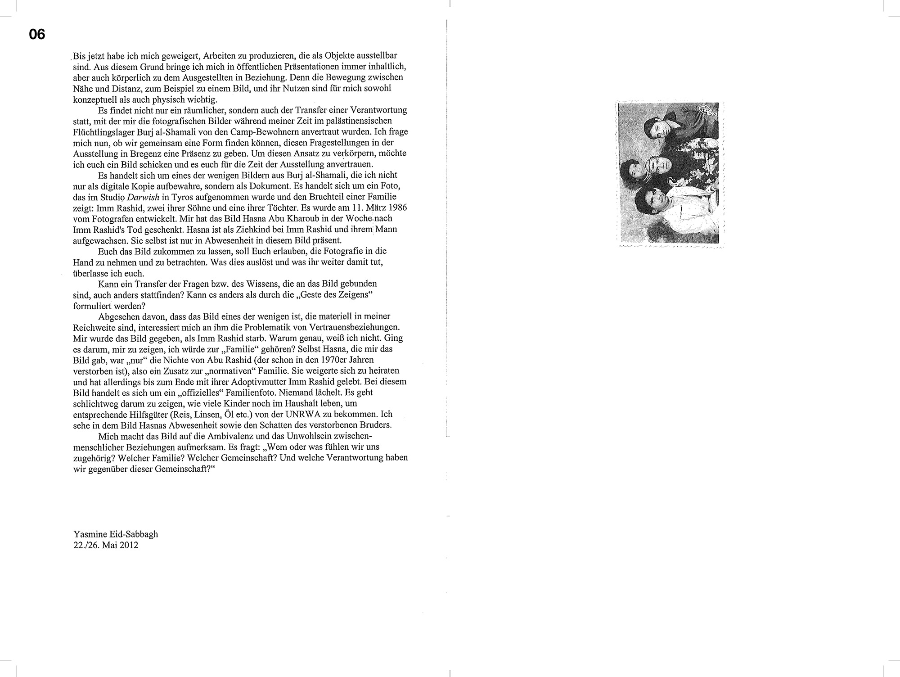
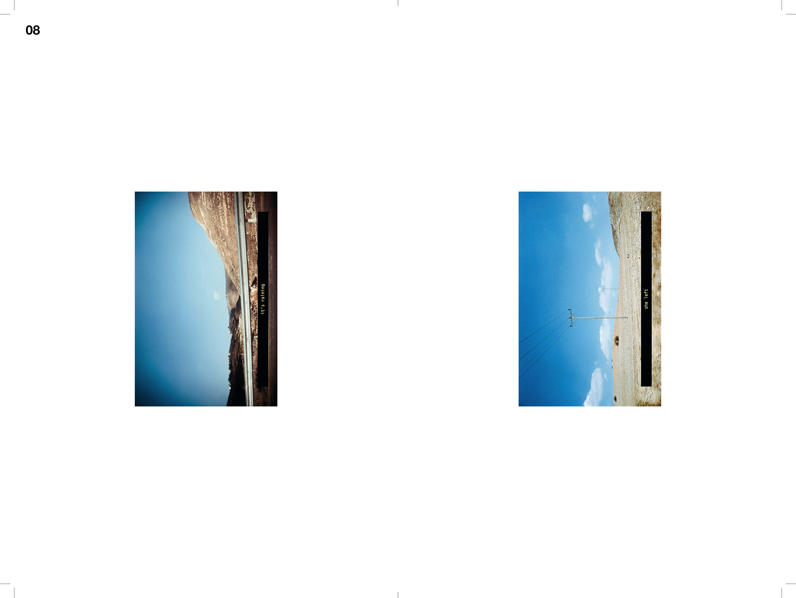
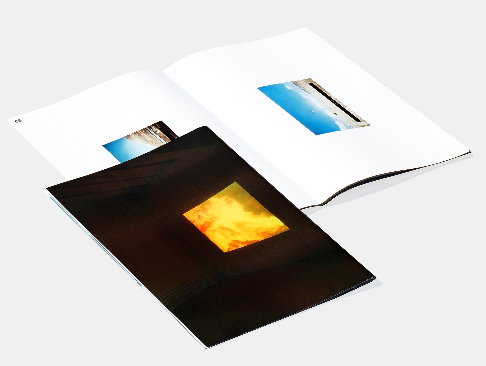
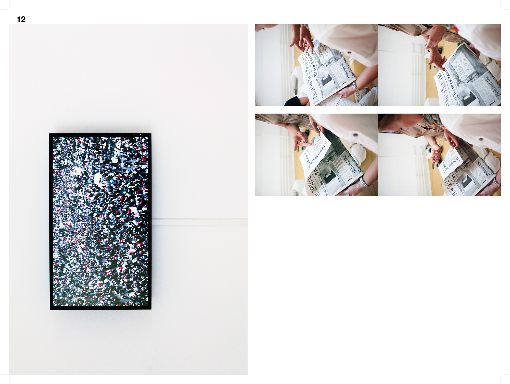
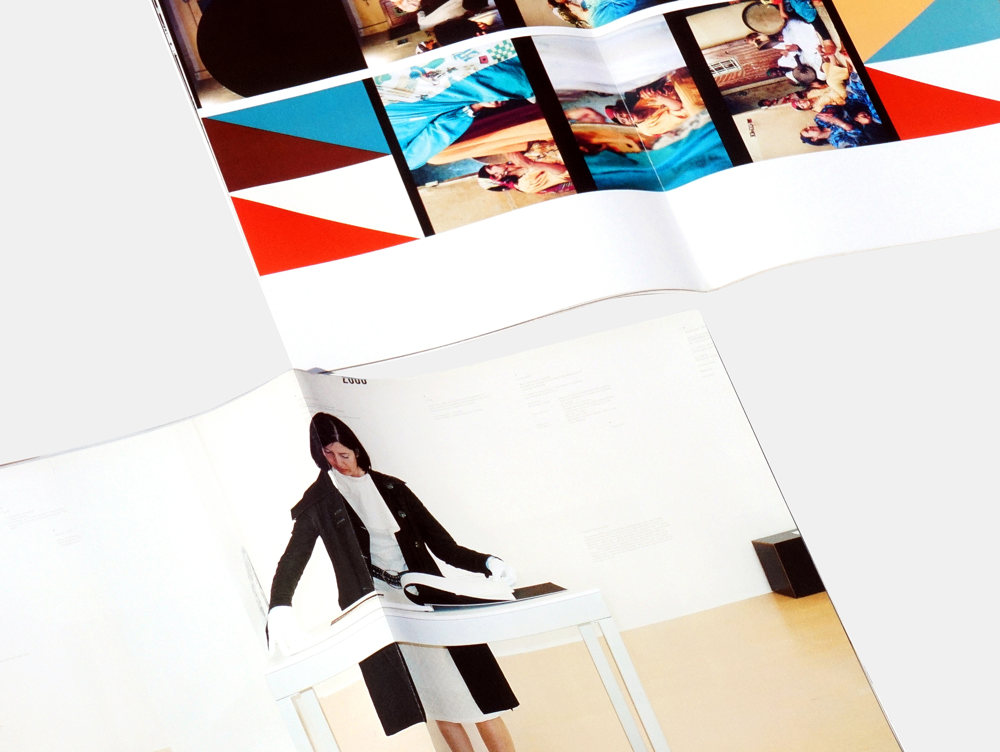
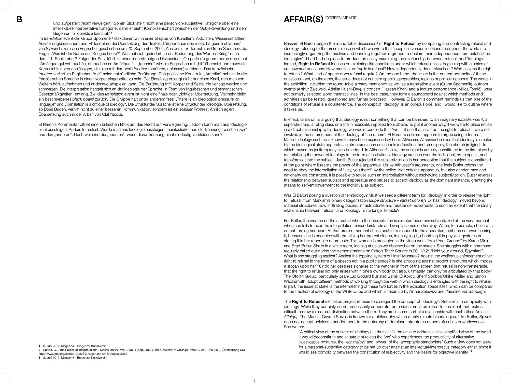
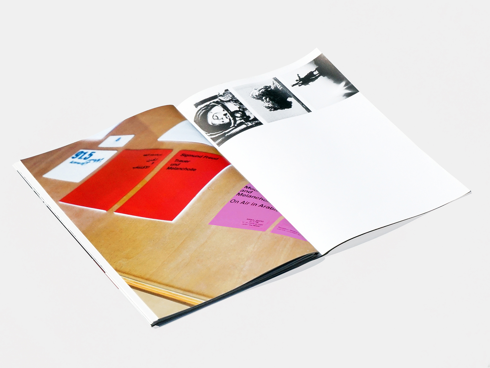

21 × 29.7 cm ● 80 pp, 600 copies ● [FR] ISBN 978-3-902833-25-9 ● ISBN 978-3-902833-25-9 ● Published by Schlebrügge.Editor and Bregenzer Kunstverein ● Edited by Wolfgang Fetz, Eva Kraus, Doreen Mende ● Printed in Austria by Riedmann Druck
The exhibition “Right to Refusal” concerns the conditions under which the articulation of refusal takes place, both in topical themes and long-standing geopolitical conflicts as well as in everyday actions and artistic production. We developed a graphic identity for the exhibition addressing this tension. The printed invitation was used as a wrap-around band for the catalogue and for other printed material. The catalogue is made of a set of A3 sheets, folded and inserted into each other. Each contribution is featured on one sheet. When reading the book, one contribution overlap with the others, creating formal and conceptual connections between all the material. The catalogue can be reordered in different combinations or taken apart and dispersed.
