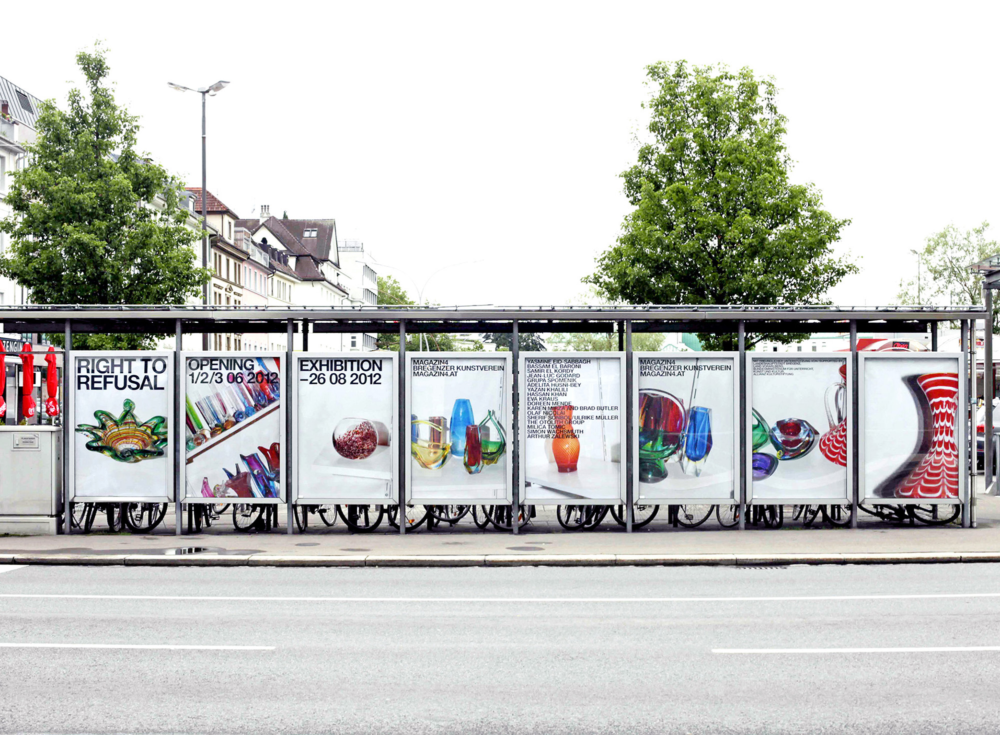
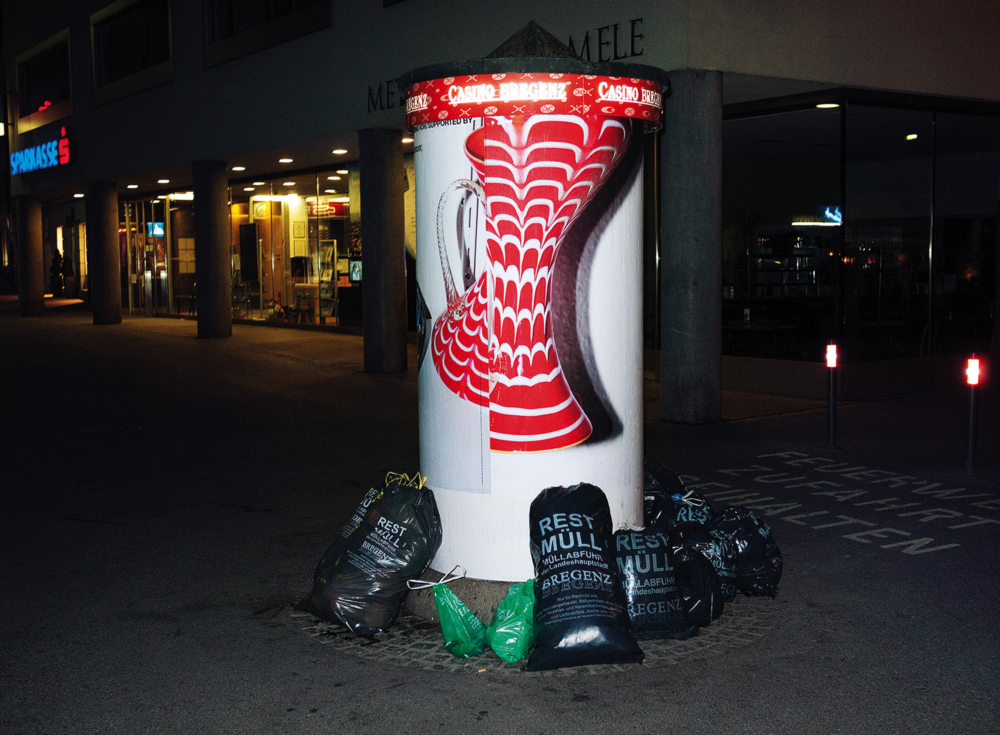
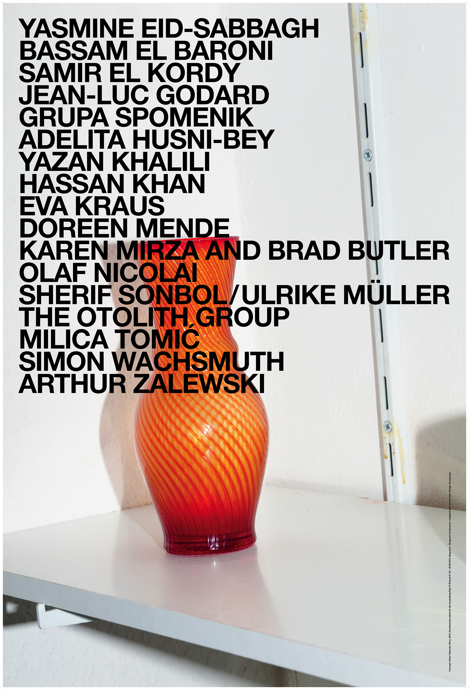

8 posters ● 118.5 × 175 cm
Arthur Zalewski’s contribution for the exhibition “Right to Refusal” is a poster-project that took place on the display boards of the city of Bregenz. The informations concerning the exhibition are fragmented and divided into eight posters. Only on few occasions the posters are presented together, allowing the passer-by to fully read and understand the message. In general they stand alone, presenting only one part of the information. 
