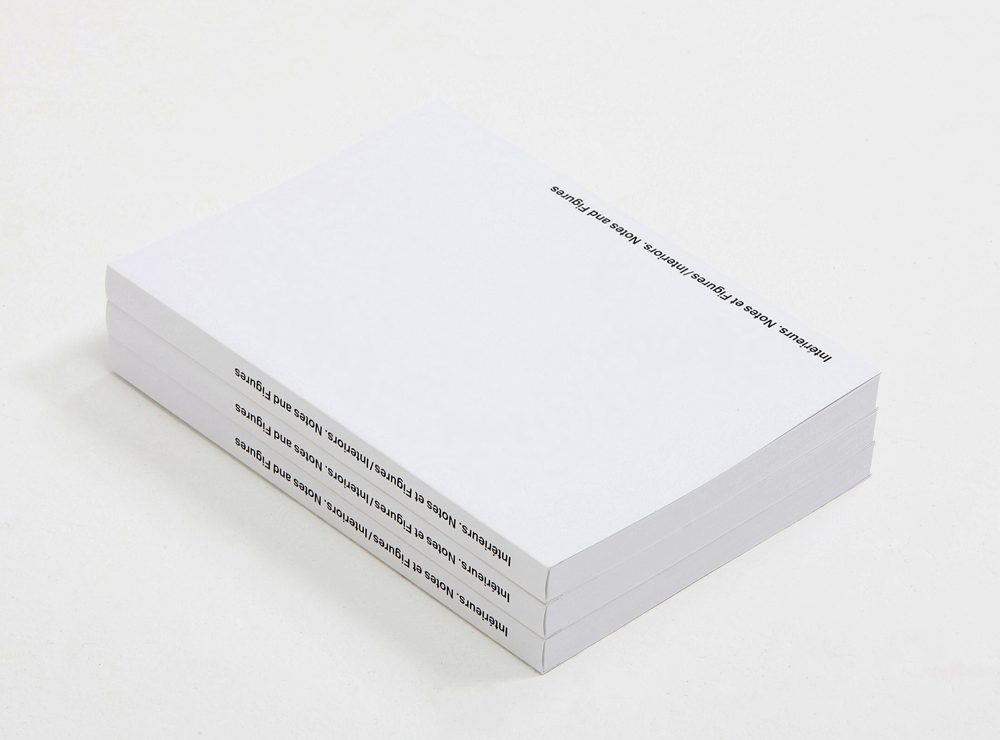
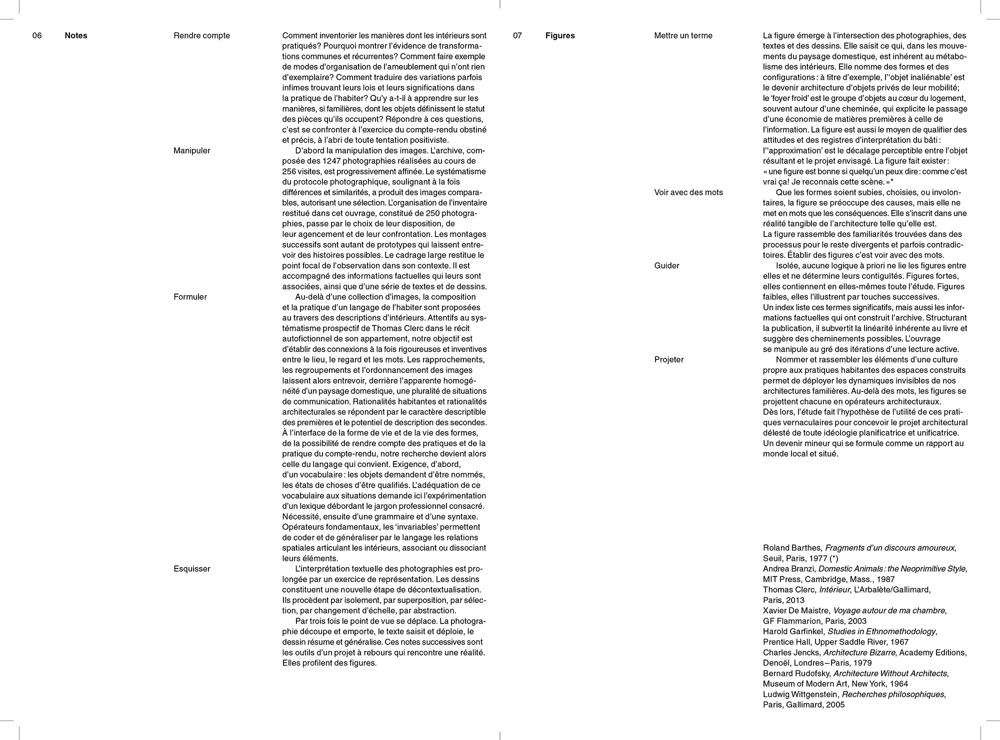
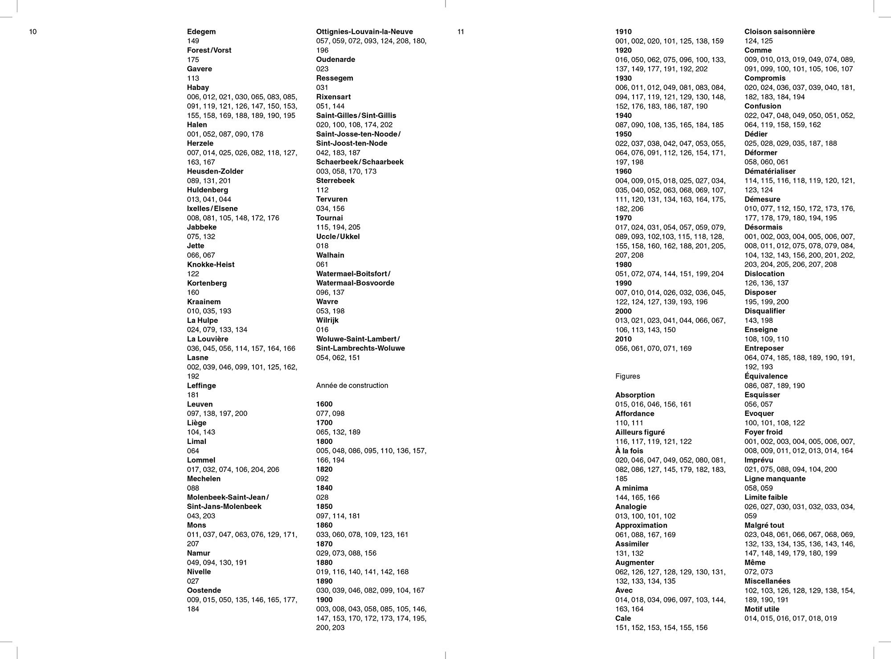
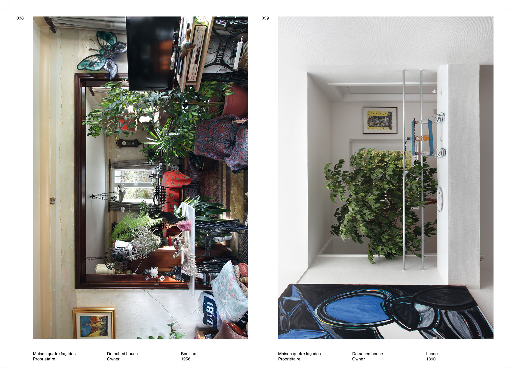
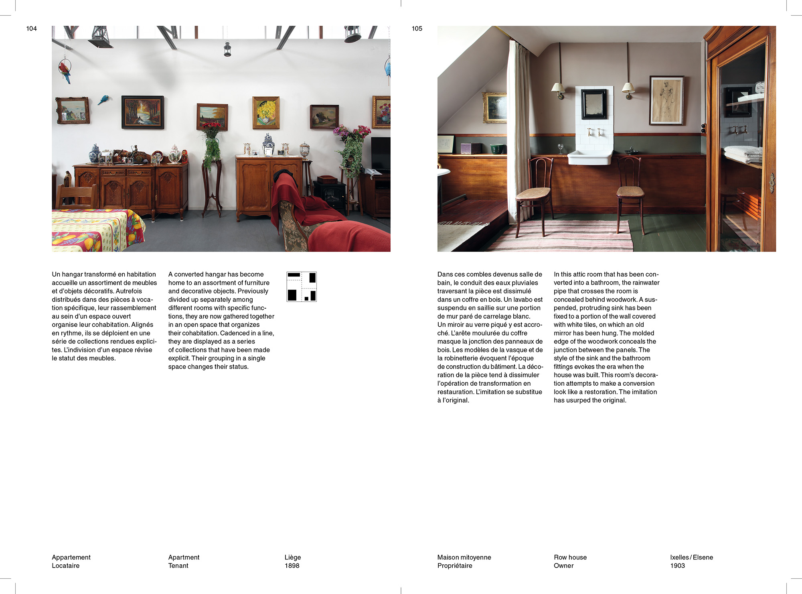
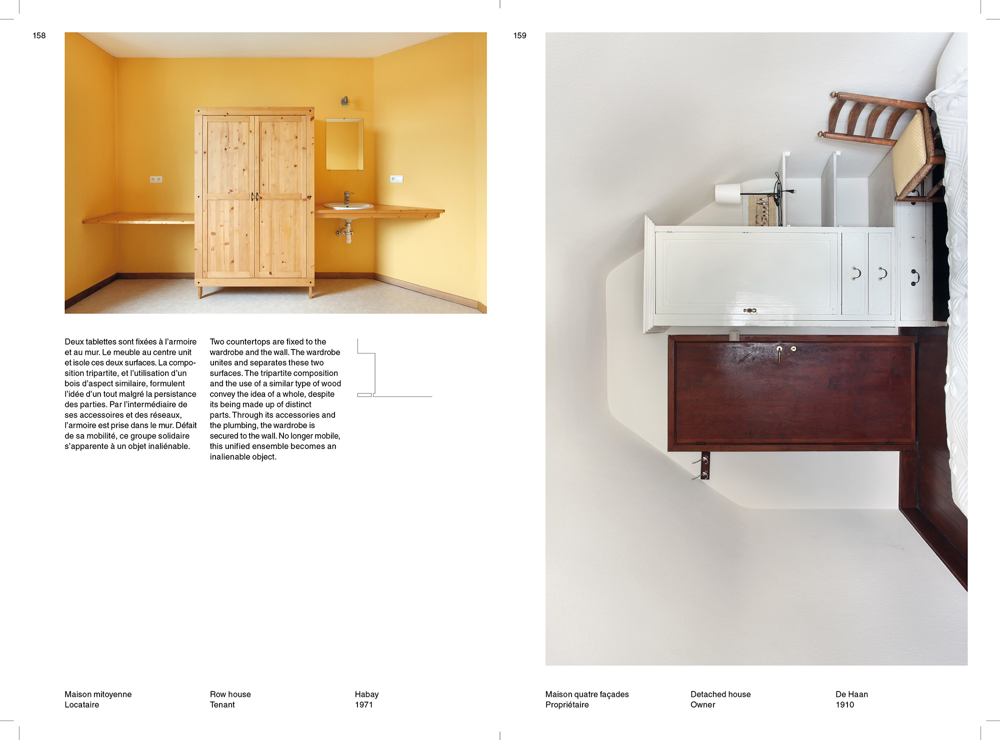
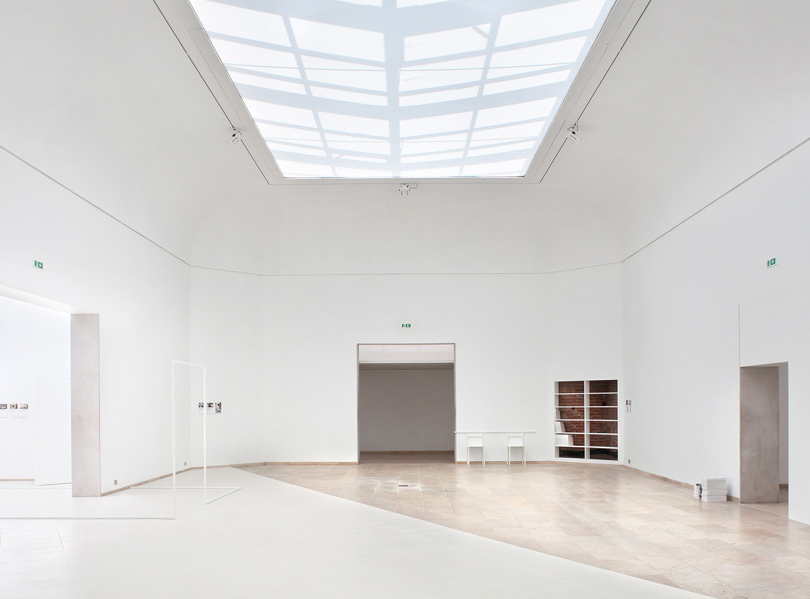
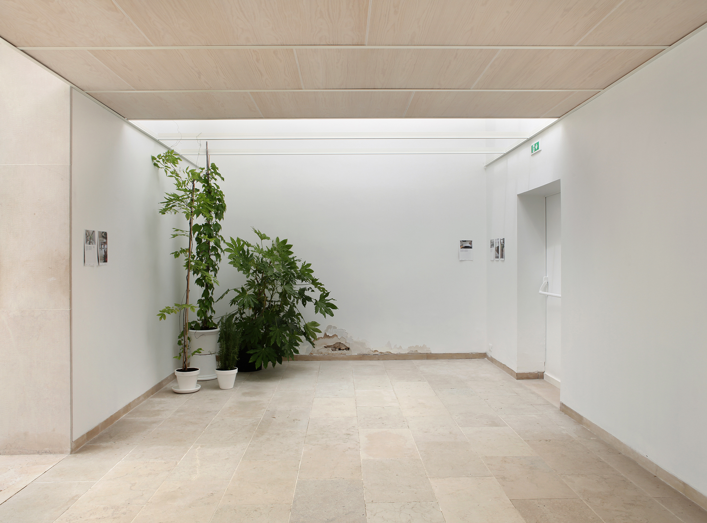
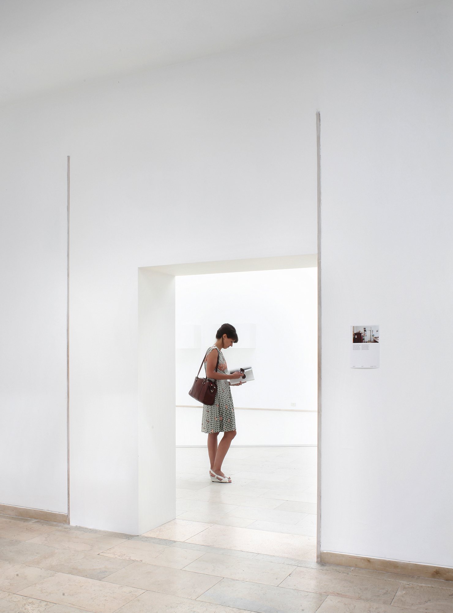
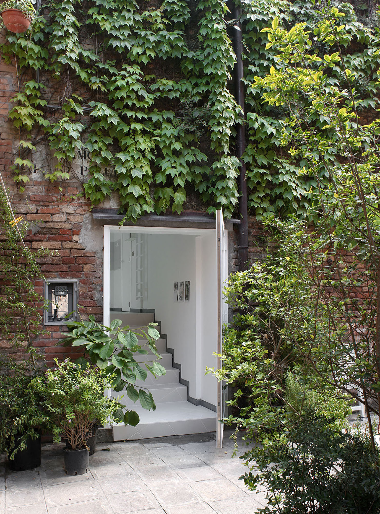

Book: 18.5 × 27 cm ● 248 pp ● 1500 copies ● ISBN 978-2-930705-06-4 ● Published by Édition de la Cellule Architecture, Fédération Wallonie-Bruxelles ● Authors: Sébastien Martinez Barat, Mathieu Berger, Benjamin Lafore, Sarah Levy ● Printed in Belgium by Die Keure ● Exhibition curated by Sébastien Martinez Barat, Bernard Dubois, Sarah Levy, Judith Wielander in collaboration with Benjamin Lafore, Sophie Dars, Mathieu Berger.
The belgian pavilion at the 14th International Architecture Exhibition of La Biennale di Venezia features an original study of domestic interiors in Belgium, based on a photographic survey made in 2014 throughout the country. Architectural transformations, adjustments and modifications of inhabited spaces have been observed and documented through a systematic protocol. For the catalogue, 250 elements were selected from the wide archive of photographs and information. On each page, image, text and architectural drawings are displayed in a systematic editorial structure. For the Belgian Pavillon at the Biennale’s Giardini, an interpretation of the research findings is presented through a minimalist spatial and architectural intervention. In order to fit this approach, the exhibition’s graphics are made by simply cutting out single pages from the publication.   Photo credit: Maxime Delvaux

