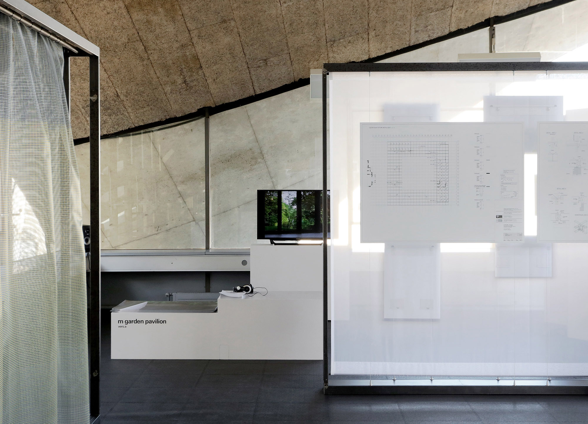
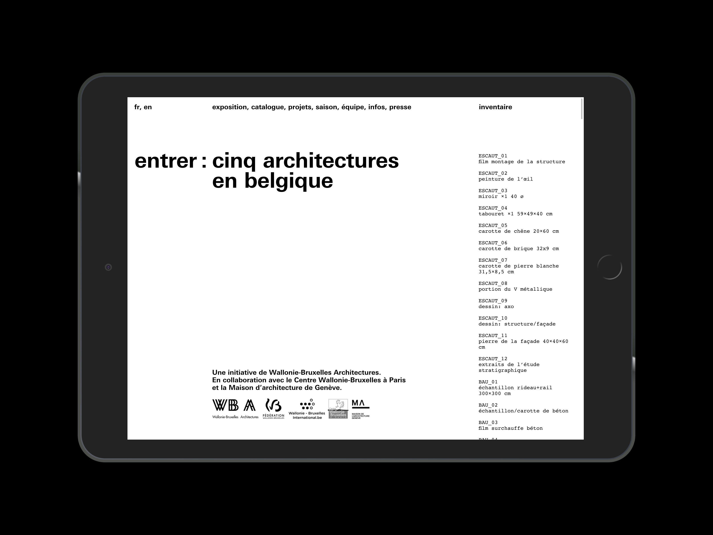
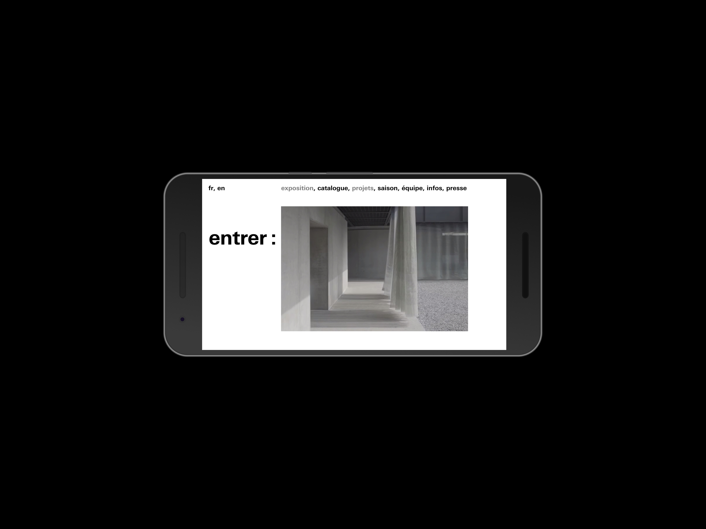
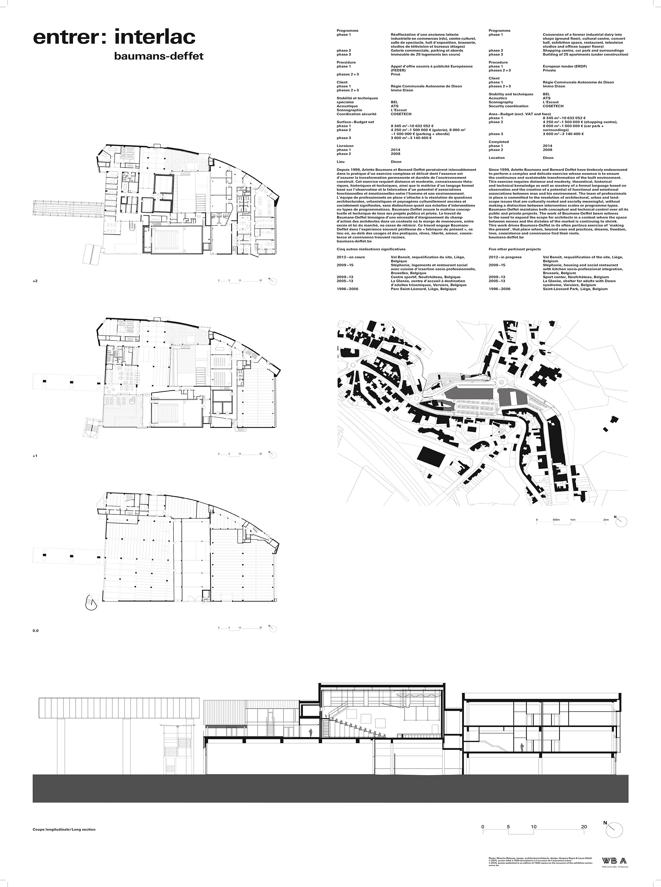
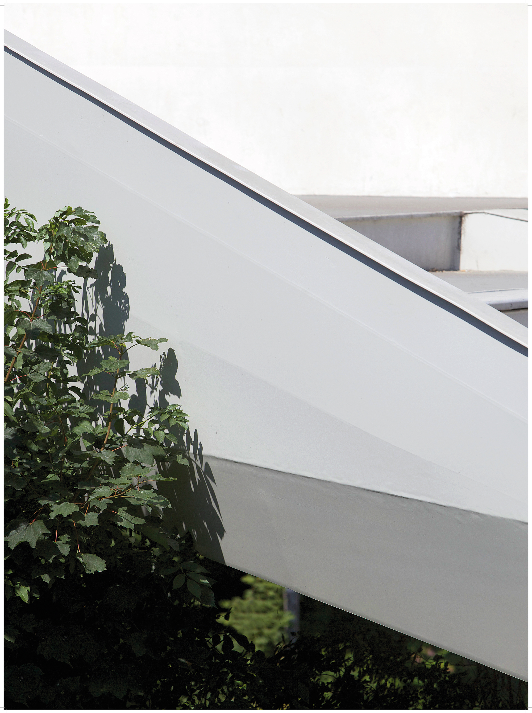
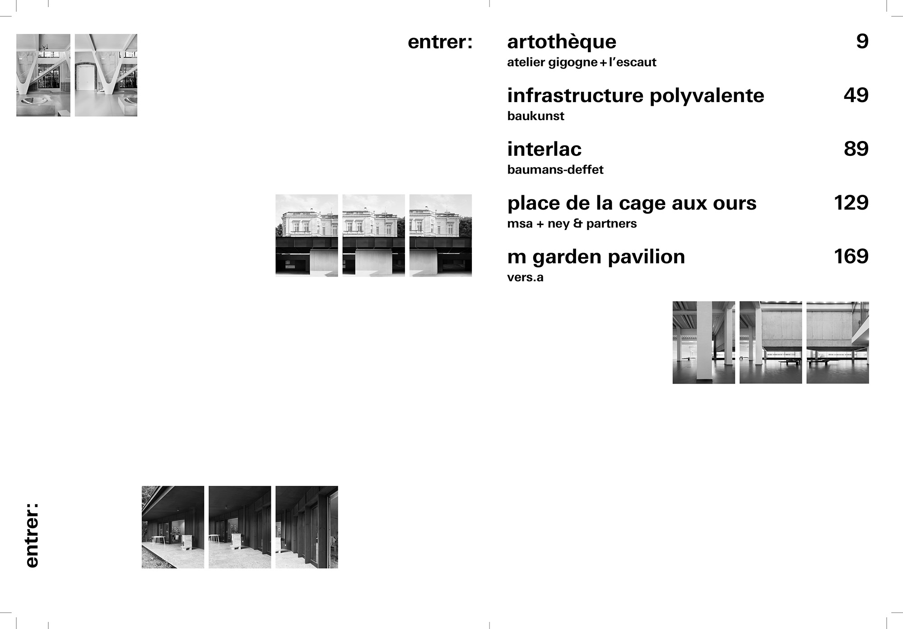
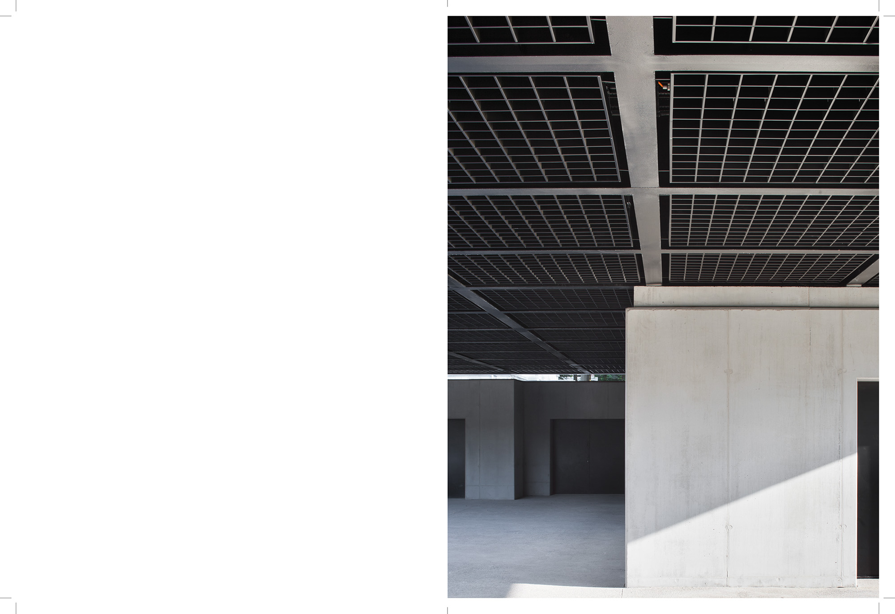
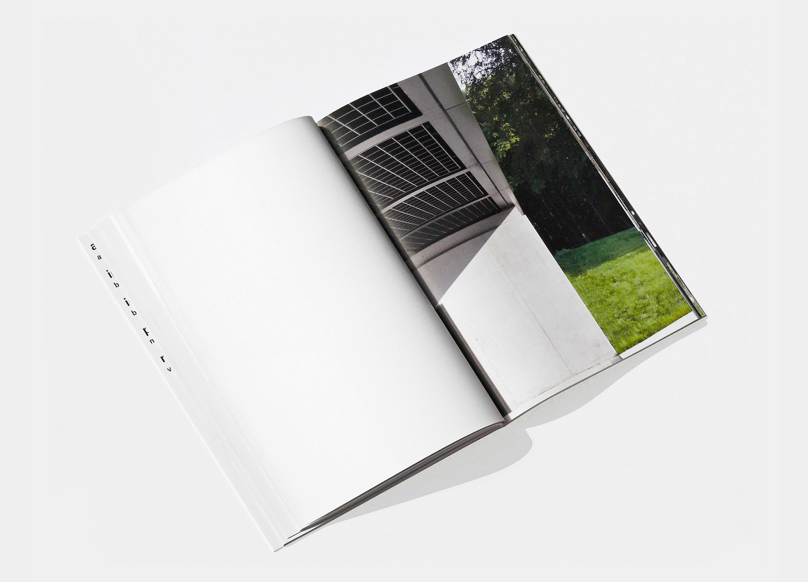
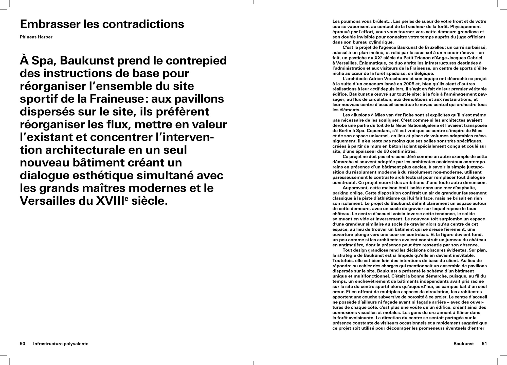
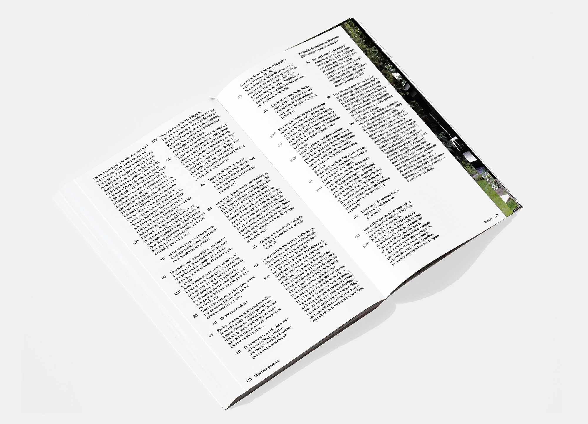

Book: 20 × 27 cm ● 208 pp ● 1500 copies ● ISBN 9 782930 705132 ● Published by Édition de la Cellule Architecture, Fédération Wallonie-Bruxelles ● Edited by Audrey Contesse ● Printed in Belgium by IPM ● Posters: 20 × 27 cm ● 7500 copies ● Exhibition curated by Audrey Contesse ● The exhibition took place in centre Wallonie-Bruxelles, Paris; Pavillon Sicli, Geneva; Festival d’Architecture de Liège; The Cass, London.
“entrer:” is an exhibition that presents five architecture projects that were built recently in Belgium. The curatorial intent was to convey the materiality and spatiality of a place outside of its context through sound bites and films. For the exhibition, we designed five posters, each displaying a full-scale detail of one of the buildings. This gesture completed the idea of entering in and experiencing these architectures. The exhibition catalogue is arranged in five sequences, each of them features a stroll into each building. The graphic identity takes advantage of the title and its punctuation.
