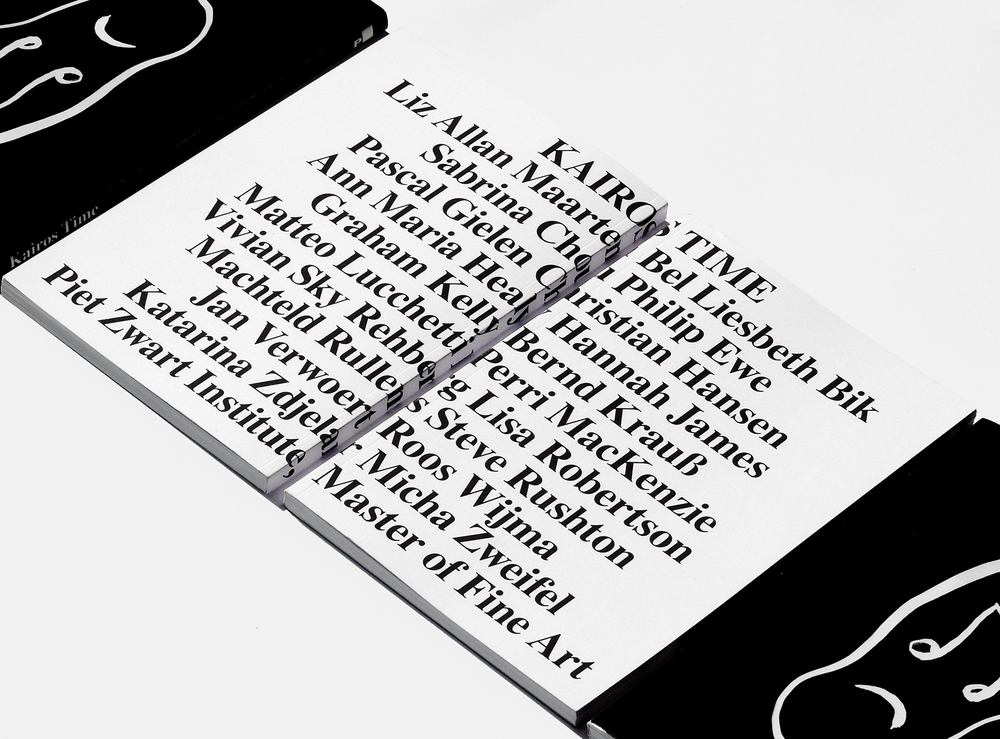
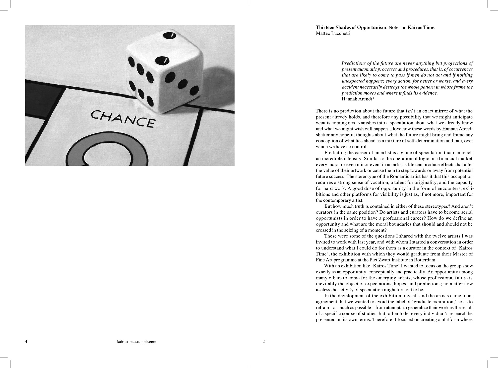
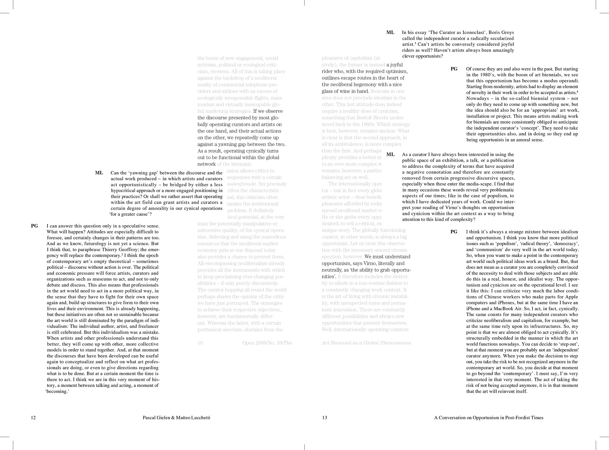
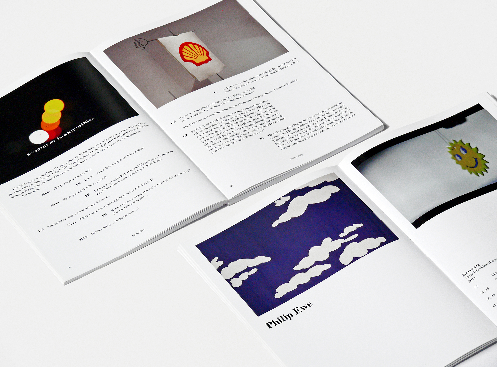
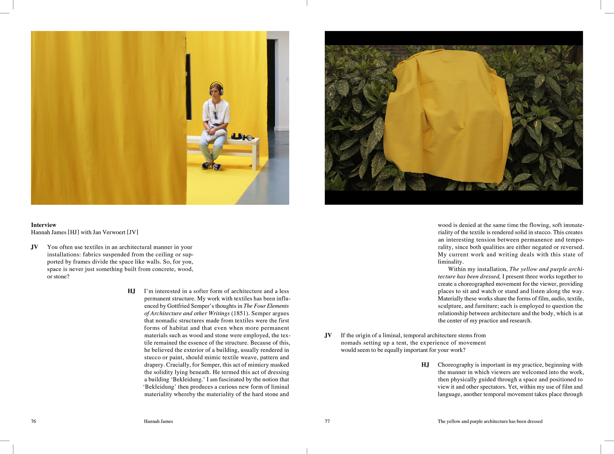
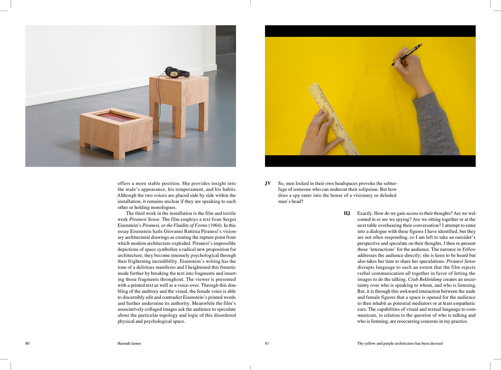
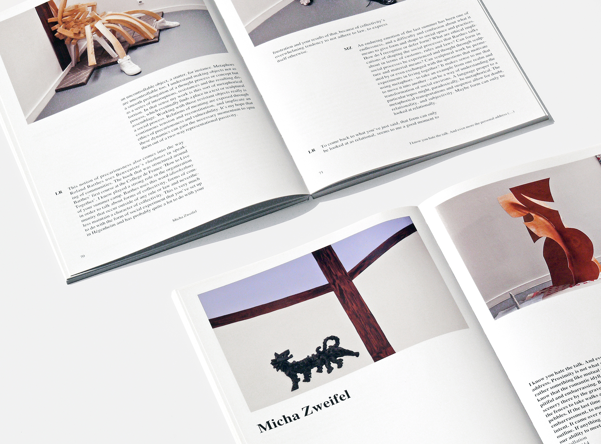
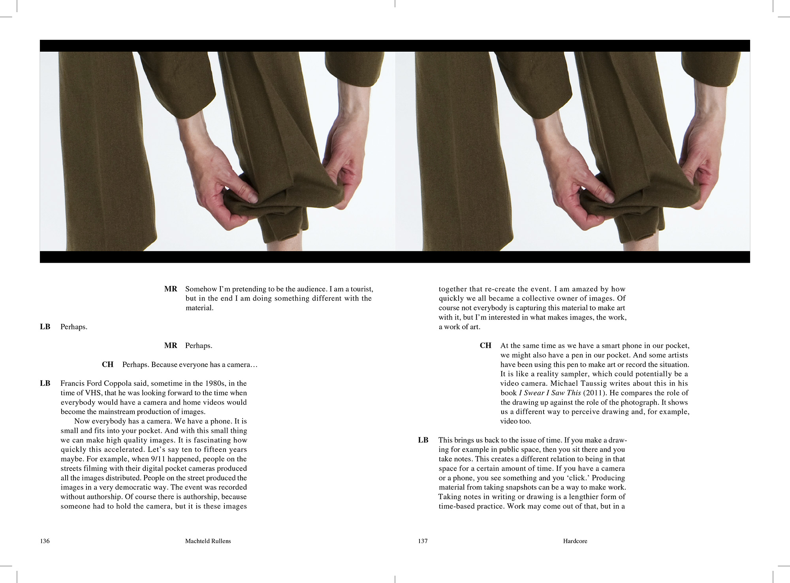
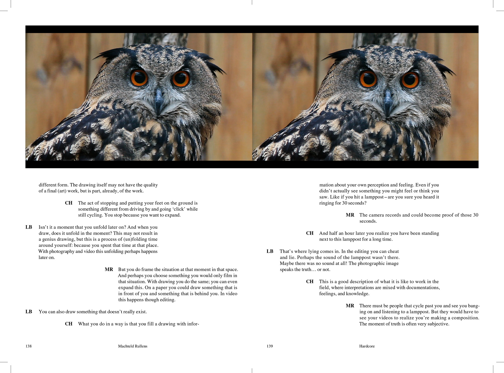

16.5 × 24 cm ● 152 pp ● 300 copies ● ISBN 978-90-813325-3-8 ● Published by Piet Zwart Institute, Rotterdam ● Edited by Matteo Lucchetti ● Printed in Belgium by Cassochrome
“Kairos Time” exhibition features twelve international artists based in Rotterdam. All the artist graduated from the Piet Zwart institute Master of Fine Art. The catalogue features a series of conversations between the artists and their tutors along with a photographic documentation of the exhibition. We structured this material by splitting the book in two distinct parts. The upper part of each pages is dedicated to the visual material. It features close-ups of exhibition photographs along with additional material supplied by the artists. The interviews are placed in the bottom part of the pages.
