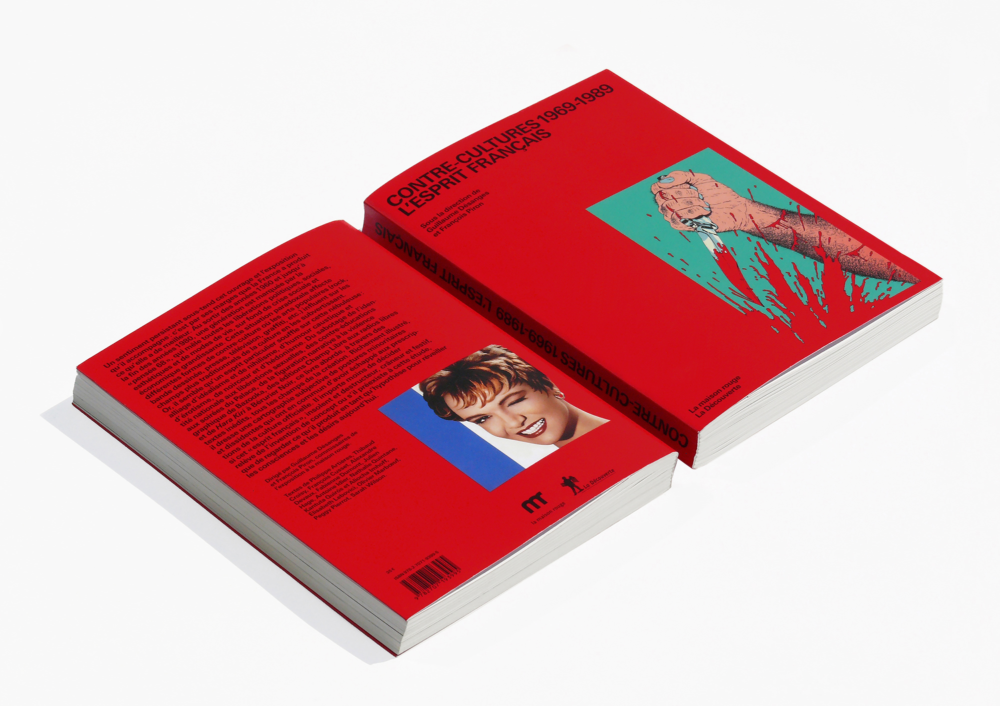
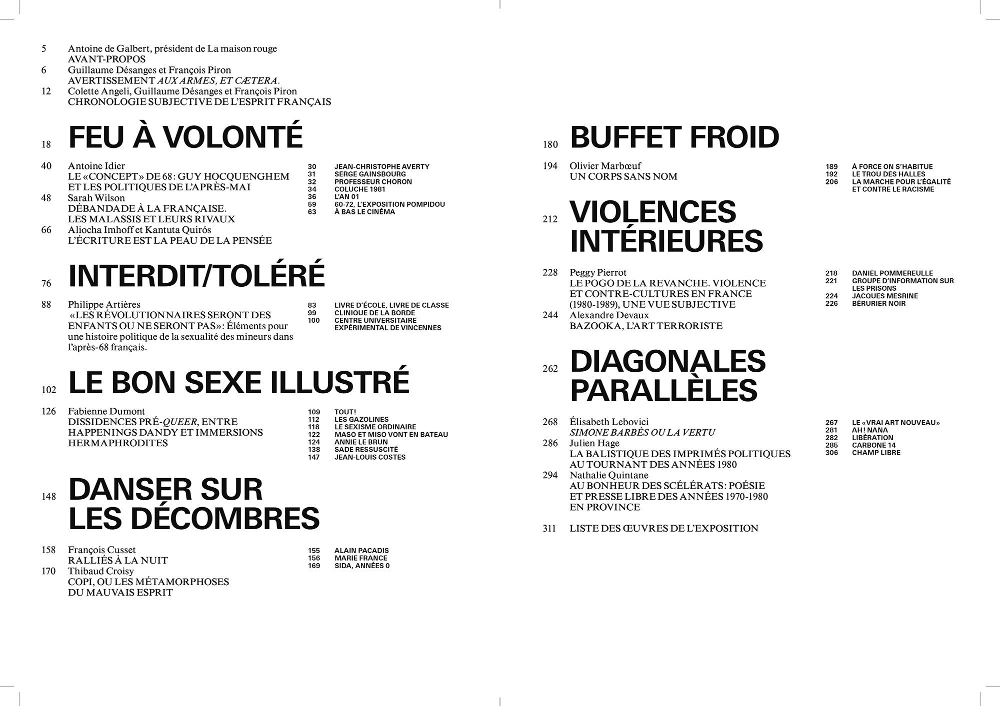
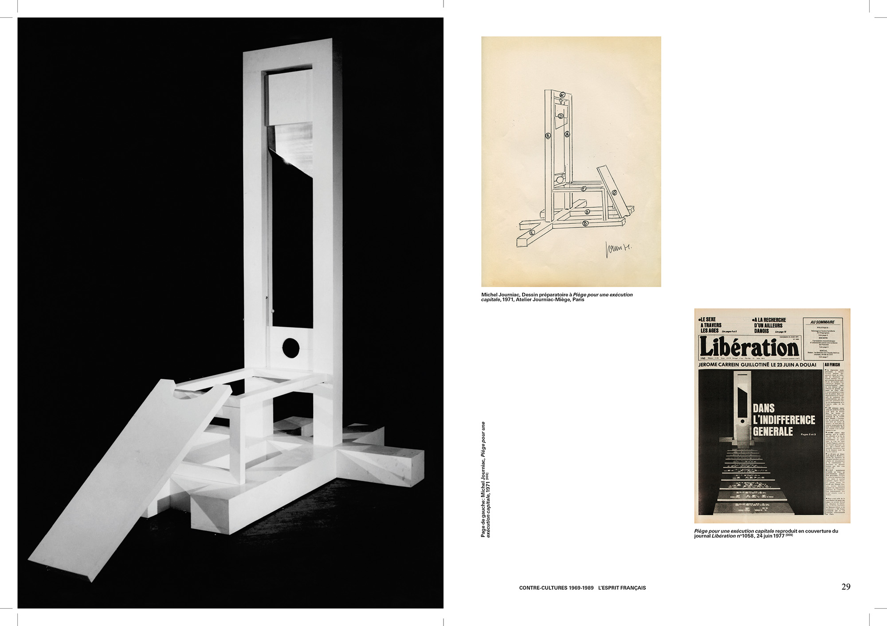
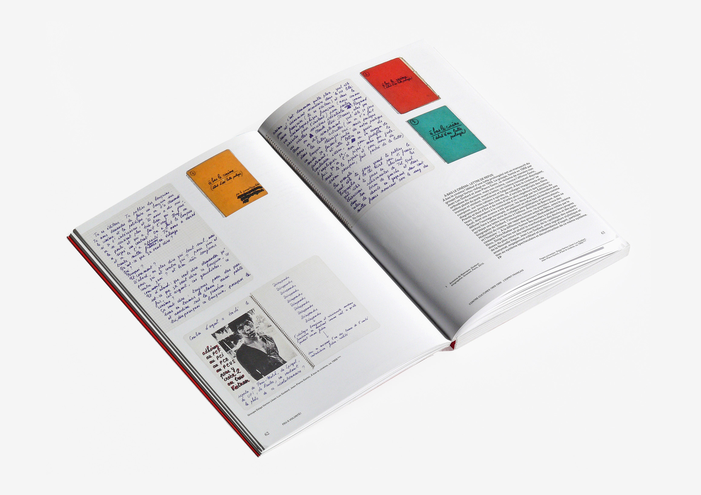
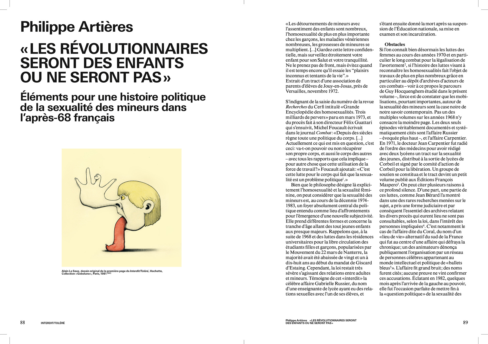
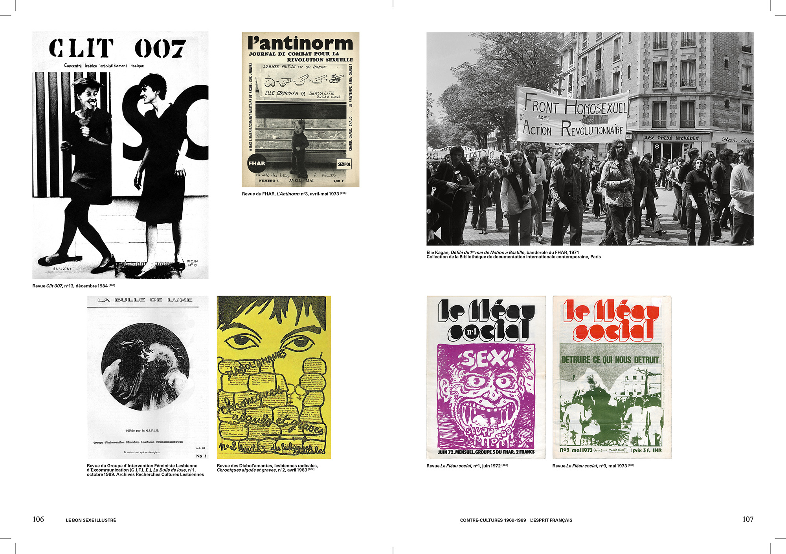
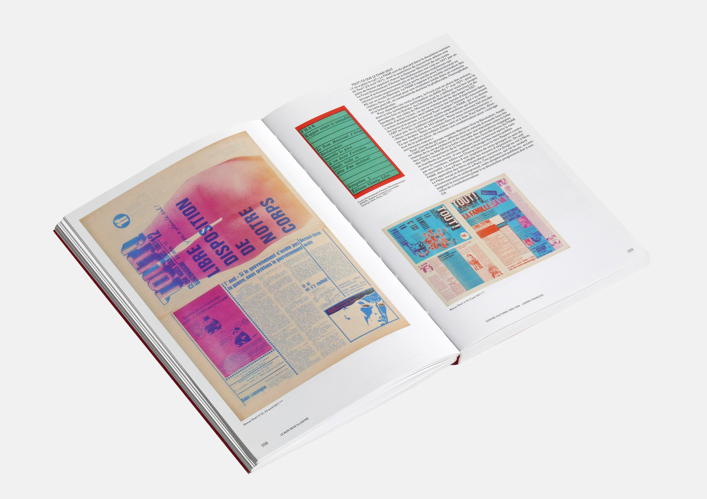
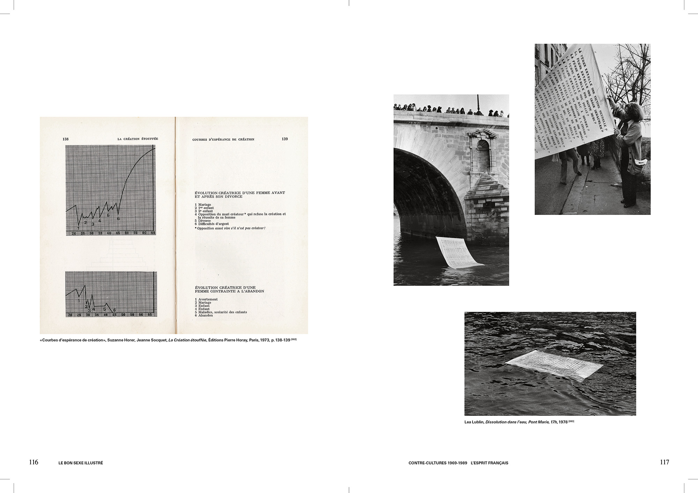

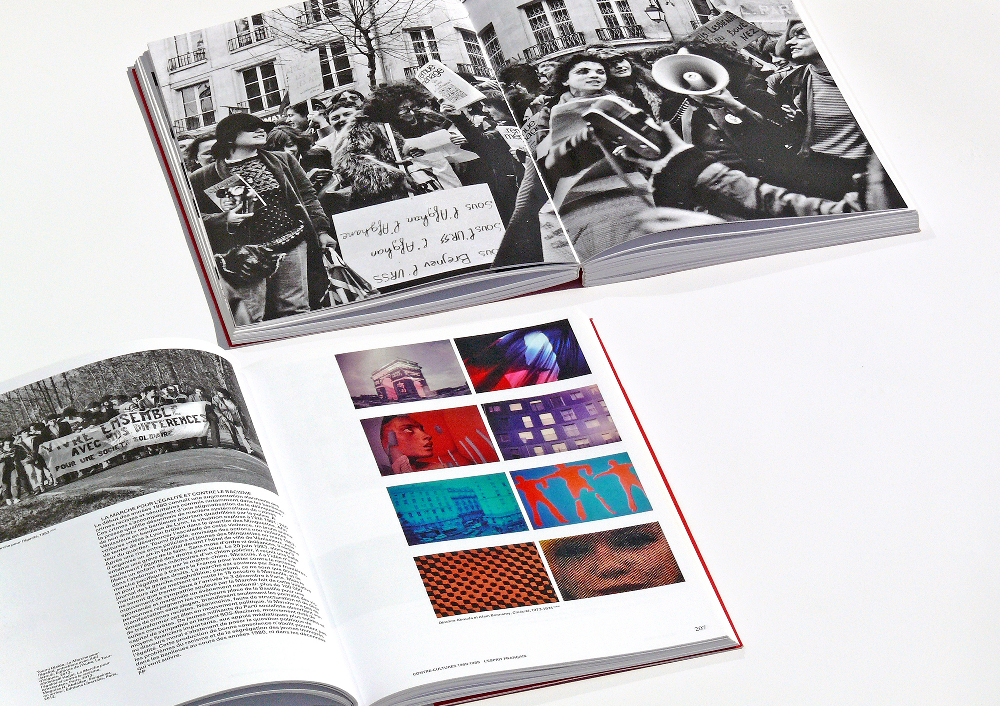
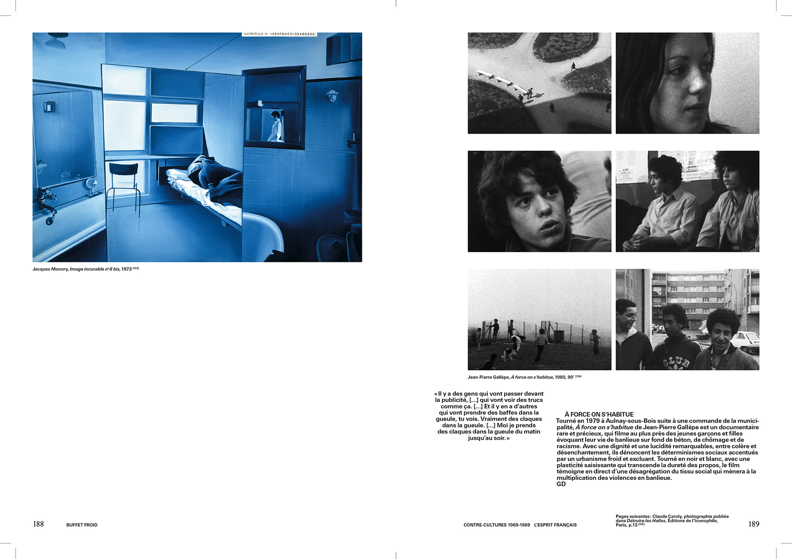
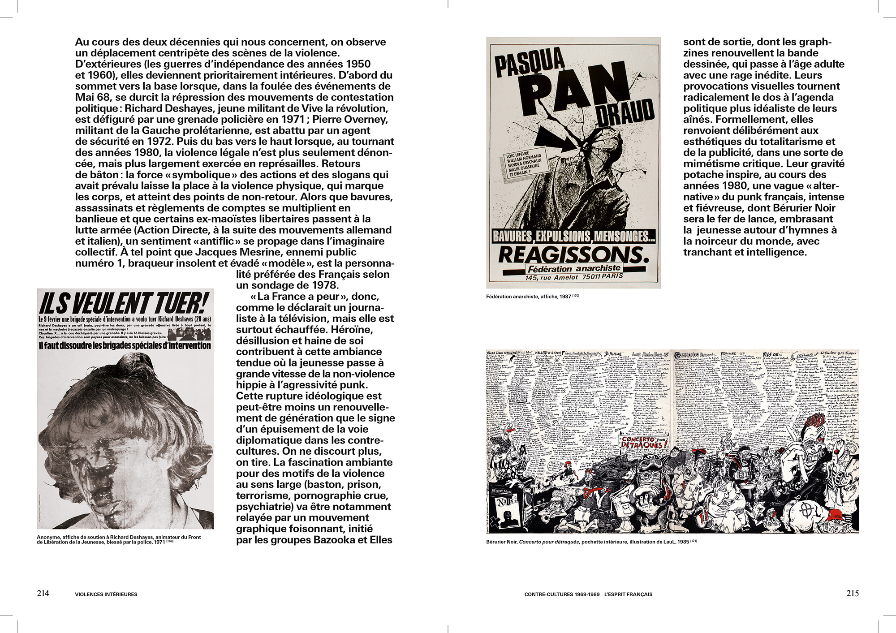
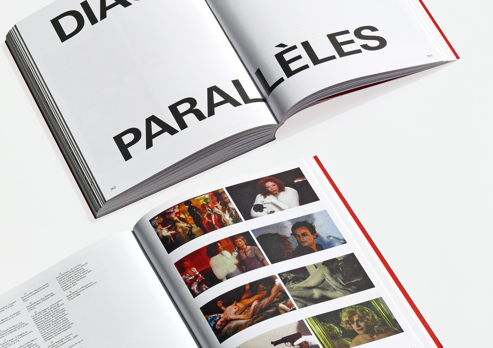

18 × 25 cm ● 320 pages ● 2500 copies ● ISBN 978-2-7071-9399-5 ● Published by Éditions La Découverte and La maison rouge ● Edited by Guillaume Désanges and François Piron ● Printed in France by Imprimerie Clerc
The exhibition “Countercultures 1969-1989 L’Esprit français” is an extensive documentation and analysis of two decades of post-68 critical, irreverent, dissenting, realms of creation in France. Several thematic nods are explored through an assembly of hundreds of artworks, documents, newspapers, flyers, posters, films and television shows uncovered from different archives.  In the catalogue, a dense amount of content is structured into seven thematic sections addressing issues like sexualities, militancy, dandyism and violence, as well as alternative education or the sabotage of the French identity. In each section, excerpts of a vast image archive, numerous essays and short sidelines are intertwined. The publication had to be both an exhibition catalogue and text-based reader. Therefore, it had to result in a substantial yet portable volume which could handle an extensive collection of textual and visual material. The layout is characterized by its graphic fluidity. It allows the reader to go from one association of aesthetically strong documents to a different one, or from one notion to another without interrupting the stream.
