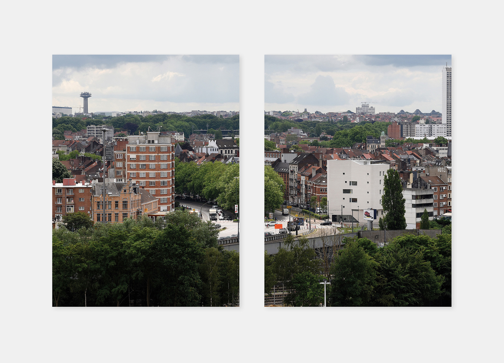
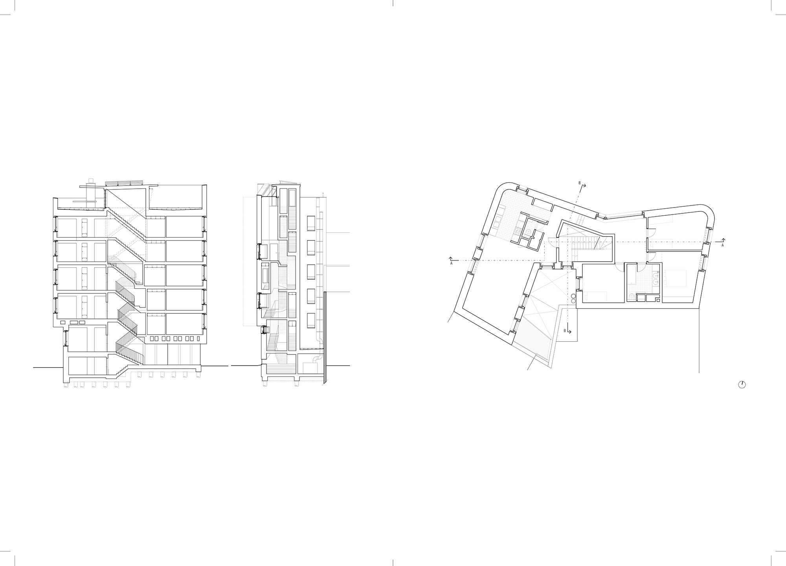
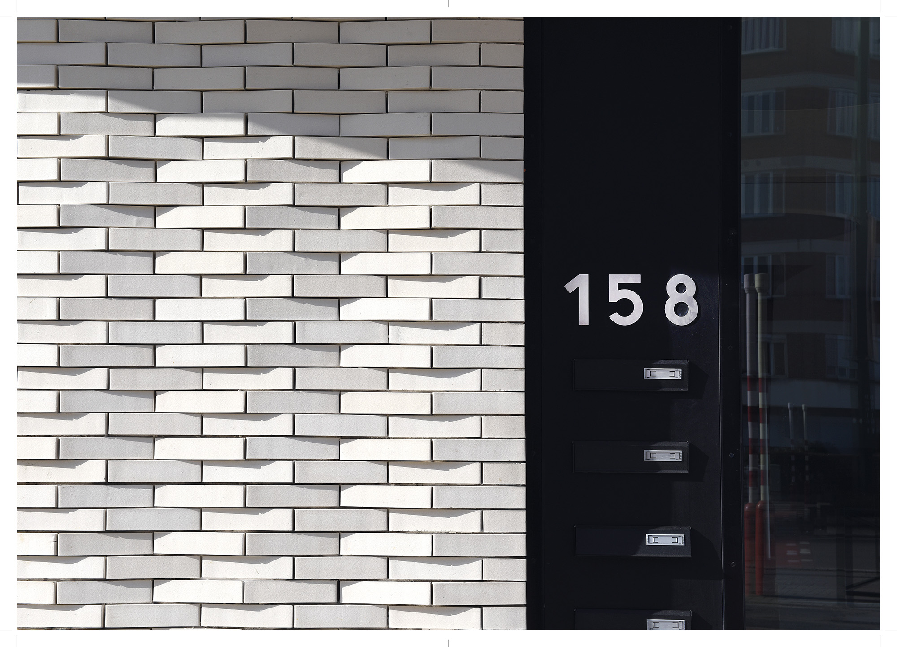
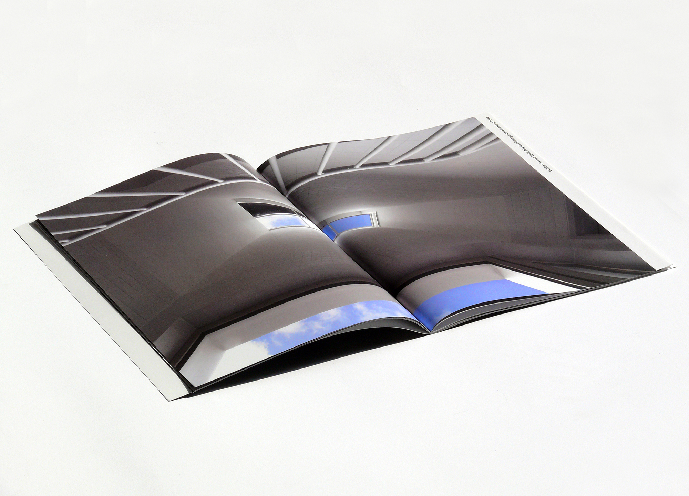
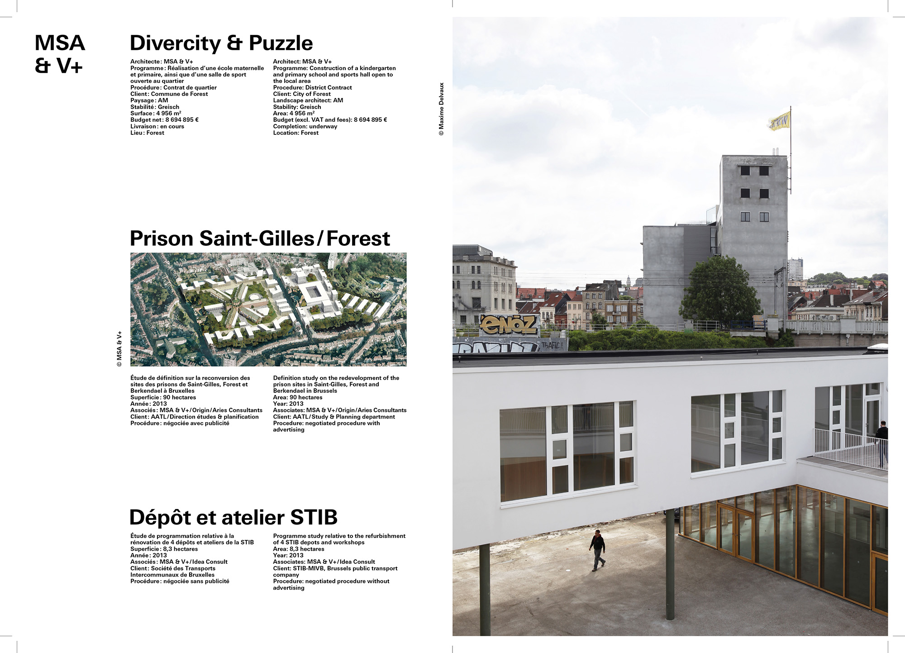
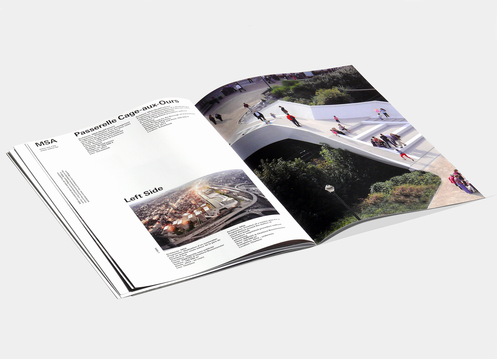
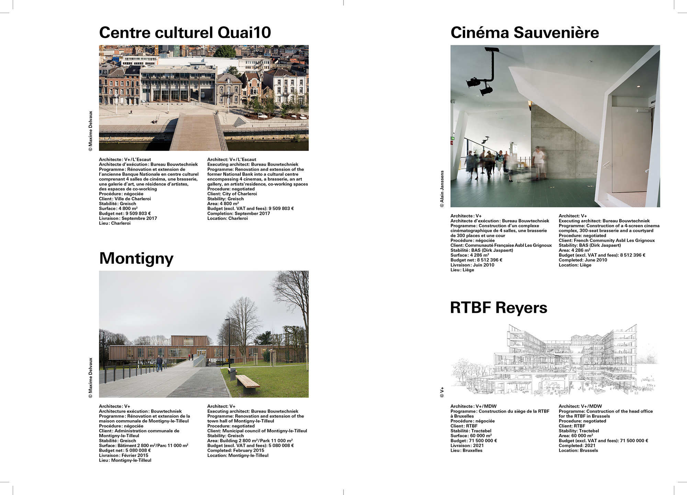

20 × 27 cm ● 32 pages ● 1000 copies ● Edited by Audrey Contesse ● Published by Wallonie-Bruxelles Architectures
Publication for Navez housing by the architects MSA and V+, recipients of the EUMies Award 2017, Emerging Prize. The brochure’s design and fabrication are linked to the visual identity of “entrer: five architectures in Belgium”.
