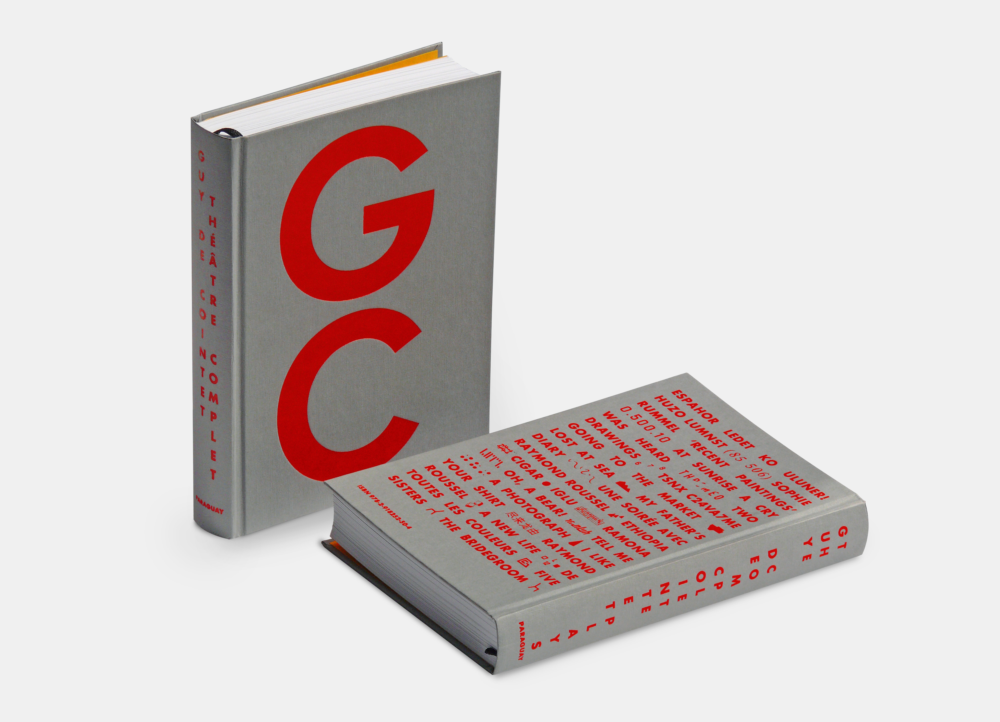
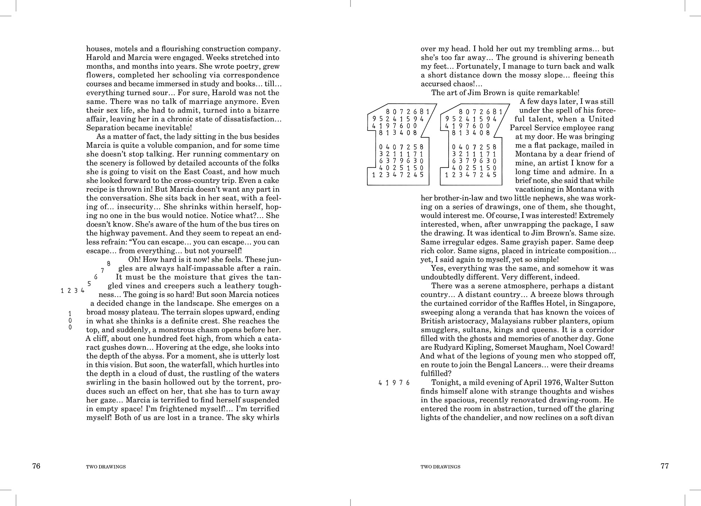
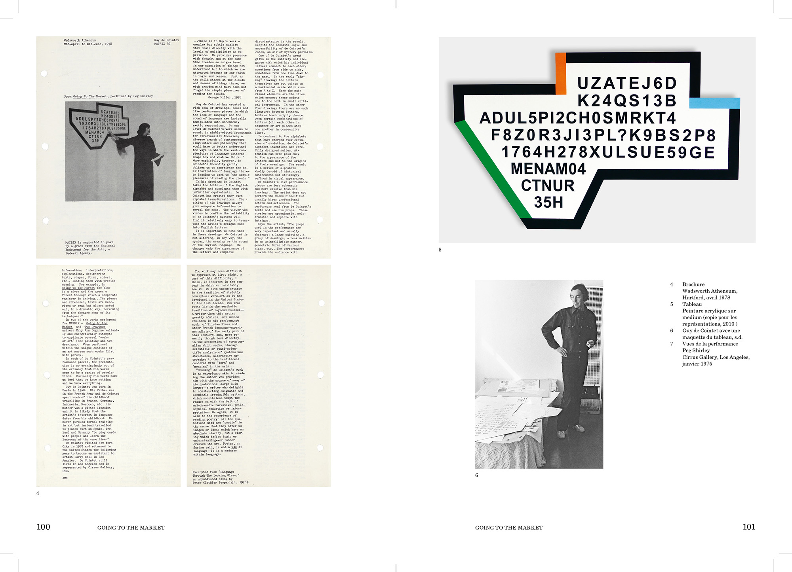
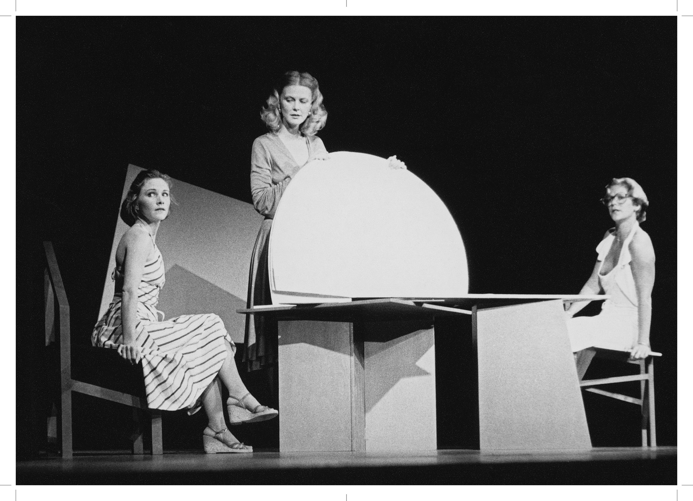
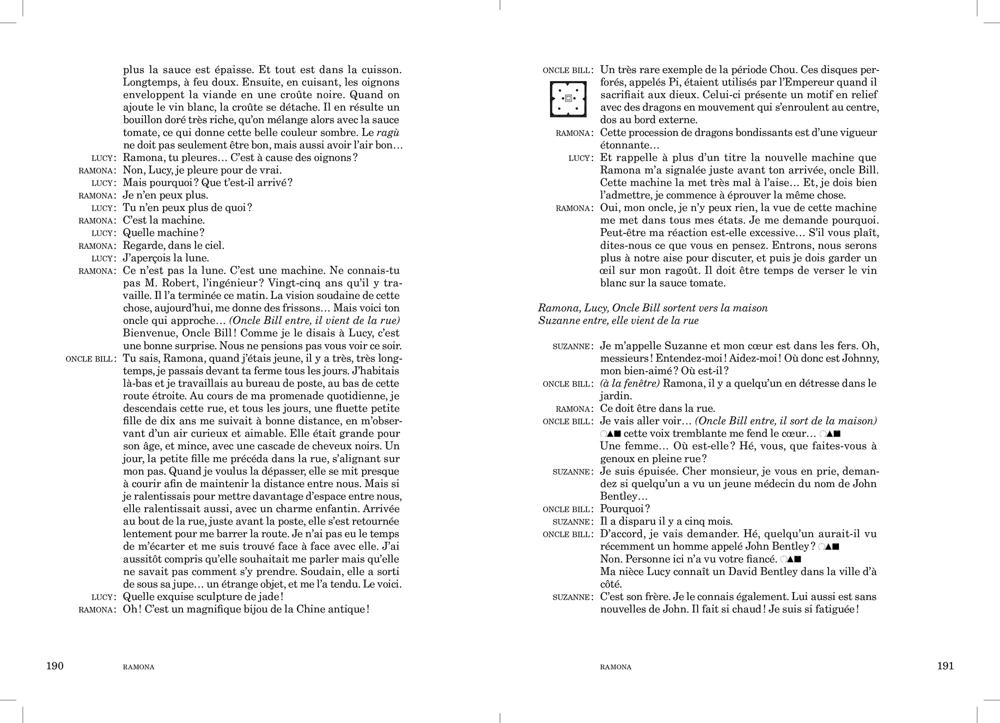
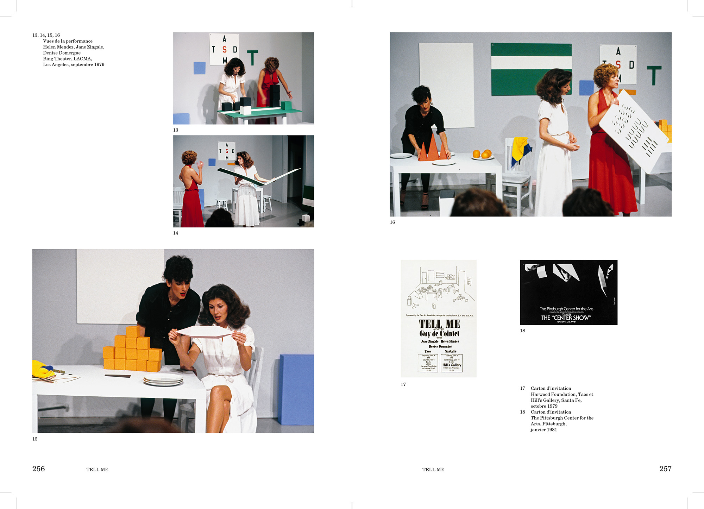
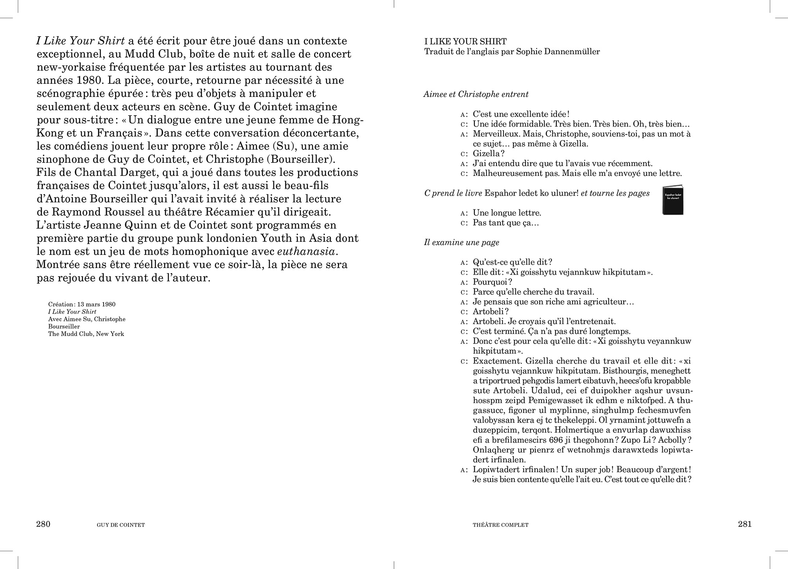
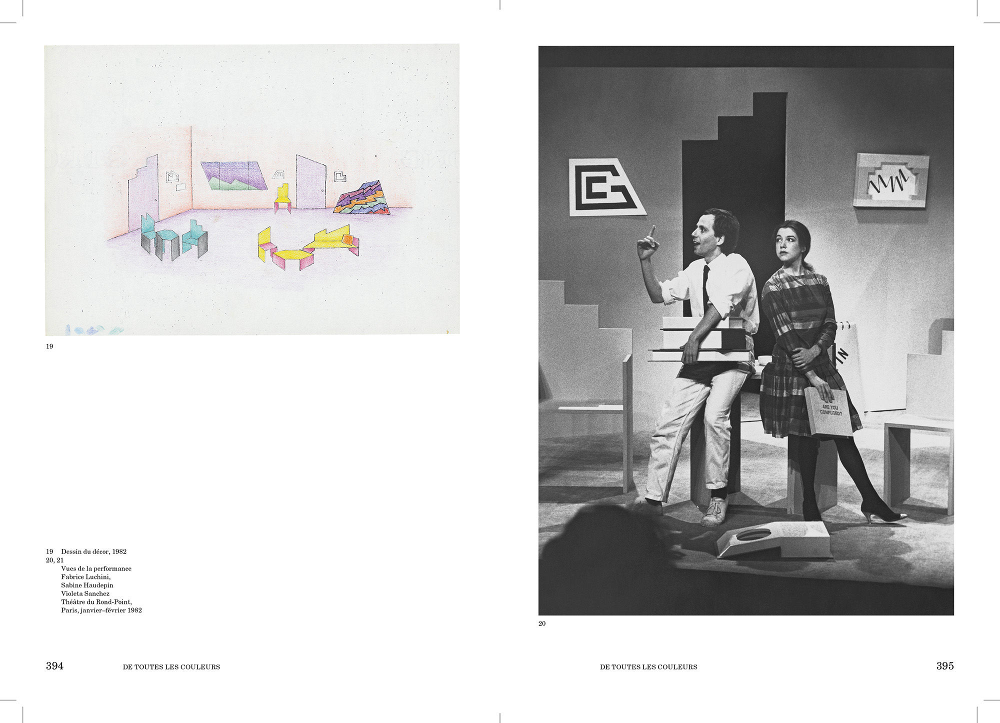

17 × 22 cm ● 448 pages ● 2000 copies ● [FR] ISBN: 978-2-918252-33-7 ● [EN] ISBN 978-2-918252-50-4 ● Published by Paraguay Press, Paris ● Edited by Hugues Decointet, François Piron, Marilou Thiébault ● Pictograms by Hugues Decointet ● Printed in Belgium by Graphius
First publication to gather all theatrical works by artist Guy de Cointet, the book presents 25 plays in chronological order, each published with an explanatory apparatus and numerous documents. The editorial structure is the one of an anthology. While browsing the book, the plays’ titles stand out from the text and images stream, they refer to some of the artist’s set design. In Guy de Cointet’s plays, narration and visual should be read together and, in order to comprehend the scripts, it is essential to understand the shape of the stage props and their manipulation by the performer. Therefore, in the book, pictograms of the accessories stand alongside the text. The stamped initials on the cover refer to Cointet stage design. Reading the book almost becomes a theatrical gesture.
