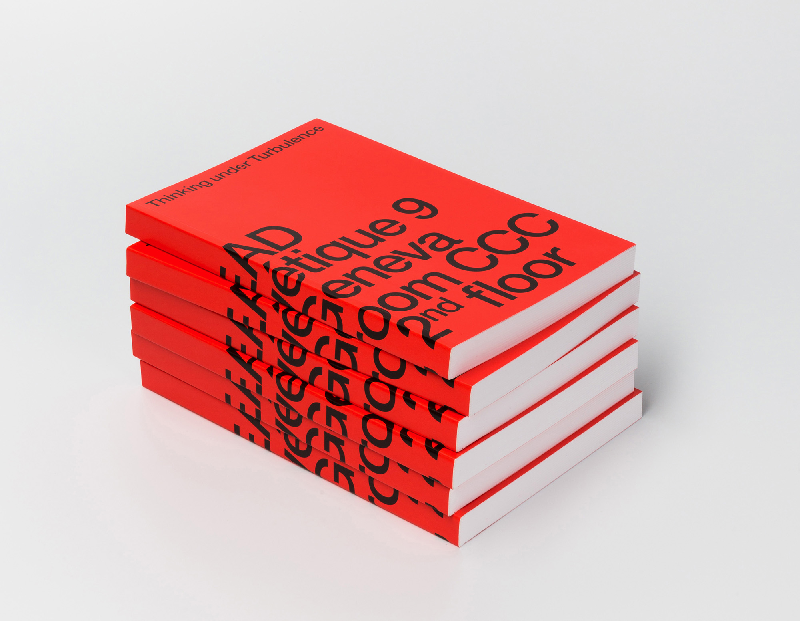
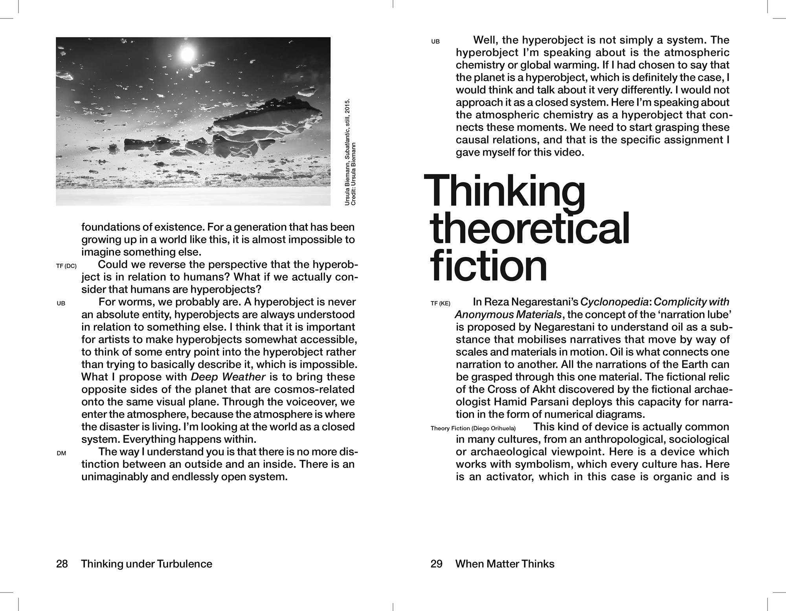
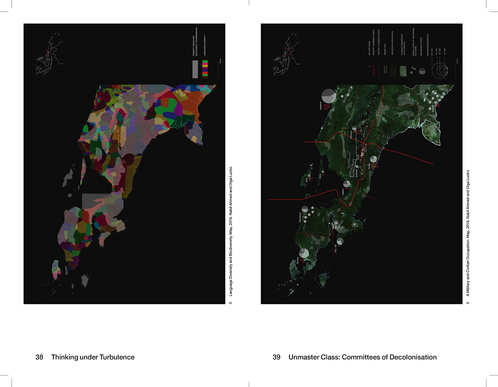
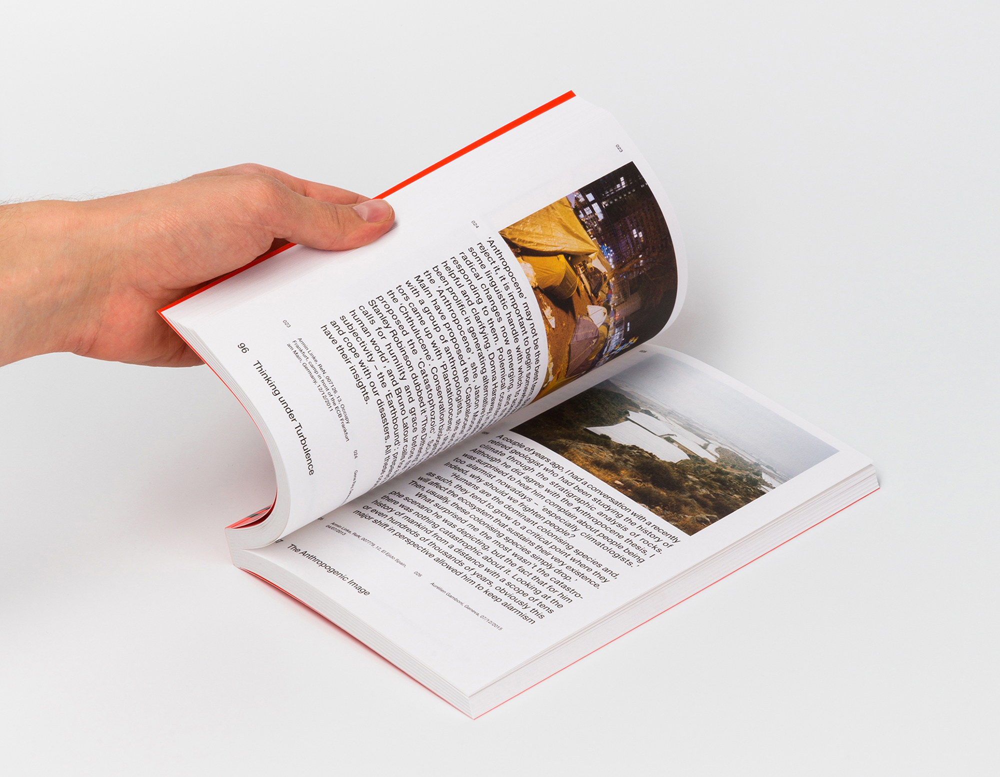
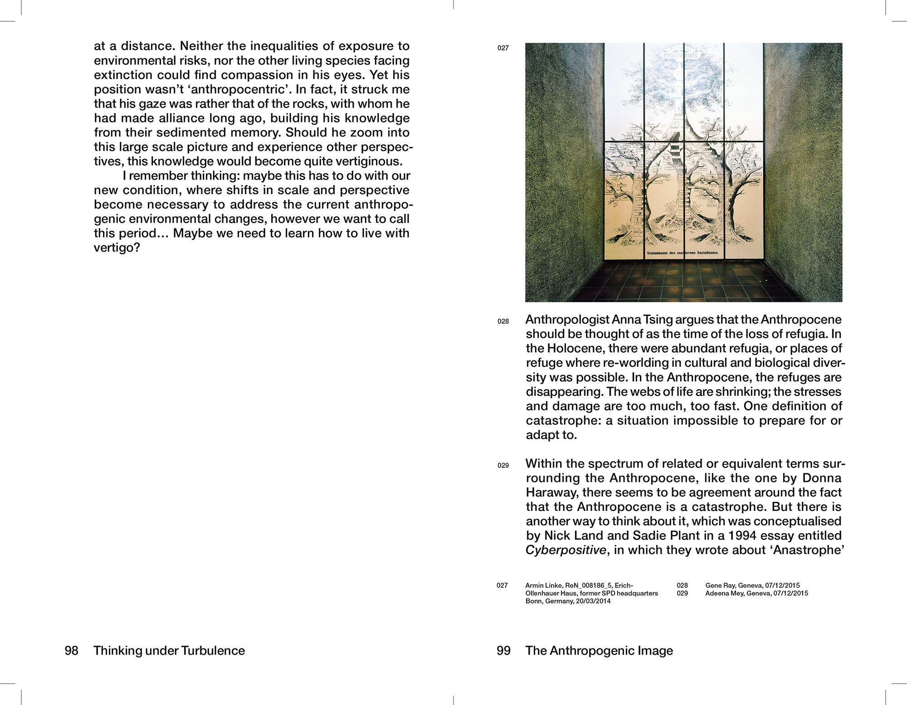
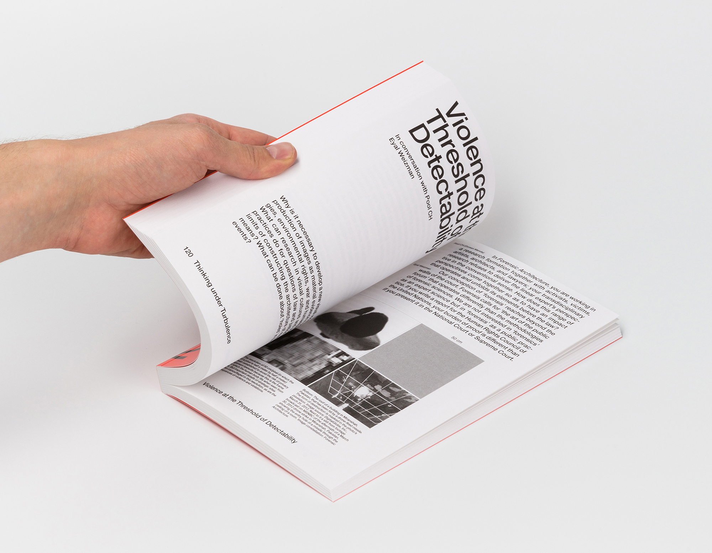
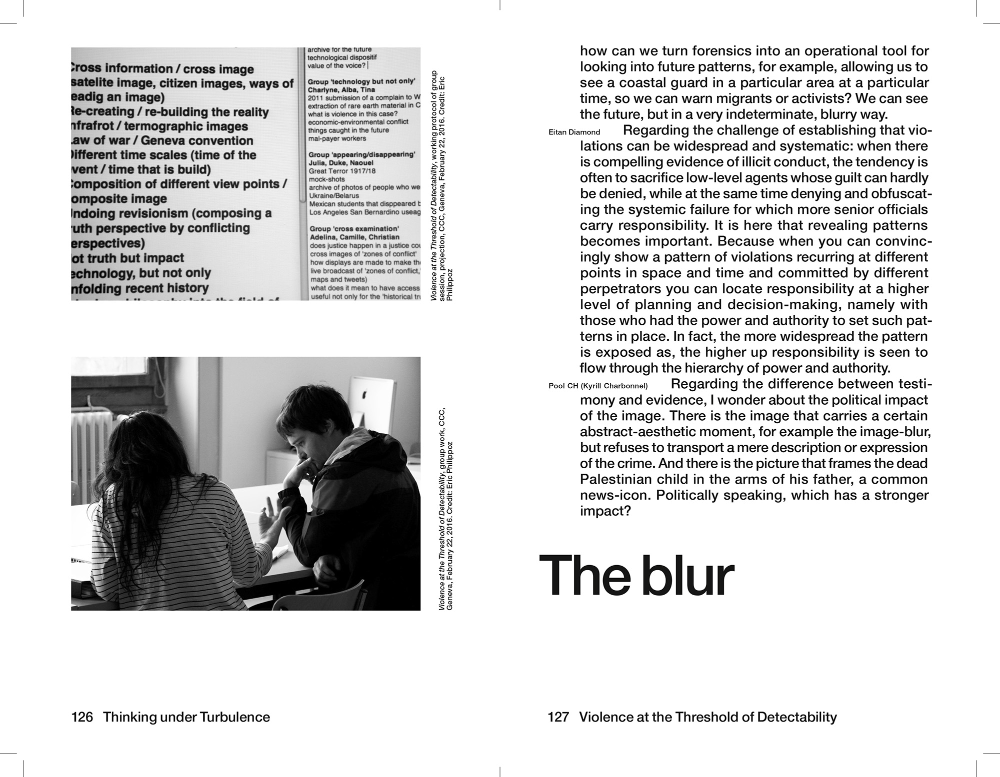
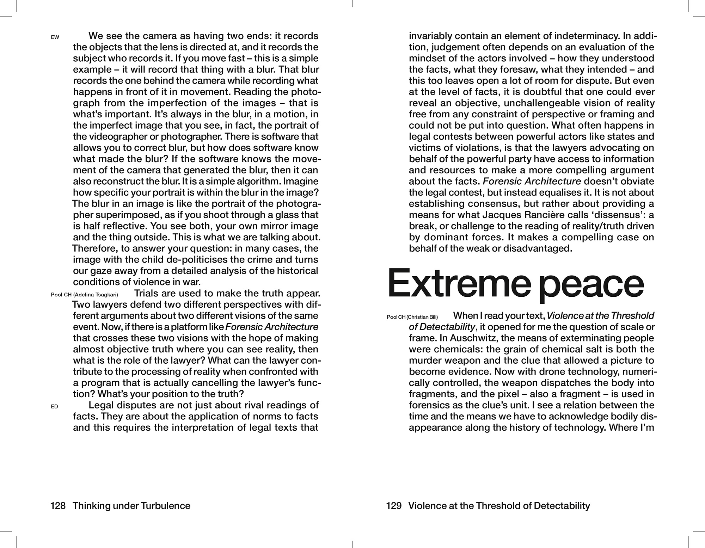

15 × 22 cm ● 192 pages ● 1000 copies ● ISBN: 978-2-9405-2455-6 ● Published by HEAD–Genève and Motto Books, Berlin ● Printed in Belgium by Die Keure
“Thinking under Turbulence” brings together voices and moments from the colloquium of the same name organized by the CCC Research Master at HEAD–Genève. The book is organized in eleven chronological sequences in which heading and titles stand out to insist on the significance that the notions of naming and vocabulary took during the colloquium.  
Photo credit: ©Michel Giesbrecht/HEAD–Genève
